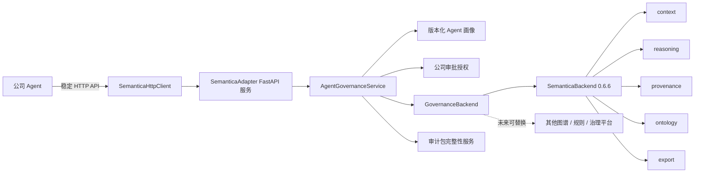
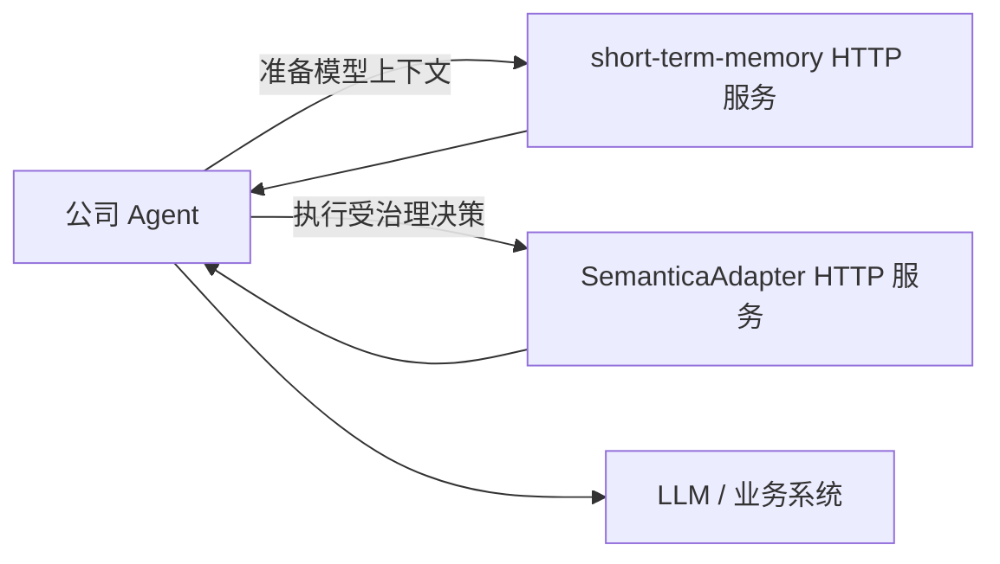

# SemanticaAdapter

许多 Agent 能够给出“通过、拒绝或转人工”的审核结果，但审核结束后，系统往往难以回答：它使用了哪个版本的规则、依据了哪些原始证据、命中了什么条件、为什么得出这个结论，以及后来由谁进行了审批。本项目引入 **Semantica 0.6.6**，把 Agent 画像、规则与本体、业务证据、确定性推理、决策结果、人工审批、政策例外和来源信息组织到同一个可追溯的决策上下文中，使 Agent 的审核流程能够被固化、解释、查询和导出，方便后续人工核对与监管检查。

项目首先面向银行等受监管行业。在金额核对、授信审核、反洗钱调查、交易异常复核和法律法规合规检查中，业务不仅需要一个结果，还需要保留能够支撑结果的完整依据。Semantica 提供的 Context Graph、确定性推理、来源追踪、本体验证和语义化导出能力，正好可以补足普通 Agent 在决策可解释性和审计可追溯性方面的不足。

推荐部署方式是把本项目作为独立的 HTTP 治理服务运行：公司 Agent 只调用 SemanticaAdapter 的稳定接口，不安装也不直接依赖 Semantica；Semantica 0.6.6 只部署在服务端。这样可以集中管理规则、审批权限、审计数据和第三方版本，后续替换图谱或推理后端时不修改 Agent 业务代码。

## 为什么引入 Semantica

本项目准备重点解决以下问题。

### 1. Agent 与规则没有稳定绑定

业务 Agent 通常拥有自己的审核逻辑，例如金额核对 Agent 需要比较凭证金额和总账金额，授信 Agent 需要执行额度、评级和准入规则。如果只把规则写进提示词或散落在业务代码中，后续很难确认某次审核究竟使用了哪个版本。

本项目为每个 Agent 建立版本化画像，绑定：

- Agent 的身份、用途和画像版本；
- 规则集 ID 与规则版本；
- 本体 ID 与本体版本；
- 允许使用的证据来源；
- 必需输入字段；
- 人工审批策略。

每次审核开始时，系统都会把当时使用的 Agent 画像快照写入决策上下文，避免规则升级后无法还原历史审核逻辑。

### 2. Agent 给出结果，但审核依据不可见

普通 Agent 可能只返回“金额不一致，需要人工复核”，却没有结构化记录支撑该结论的事实和规则。本项目使用 Semantica 的确定性推理能力，保存输入事实、命中规则、推理结论和面向审核人员的解释步骤。

这里记录的是可公开核验的系统级依据，例如：

```text
事实：declared_amount != ledger_amount
命中规则：amount_mismatch → manual_review
结论：manual_review
```

它不是模型的私有思维过程，而是由业务事实和确定性规则产生、可以被人工重新计算的决策说明。

### 3. 证据、决策、审批和例外记录相互分离

一项审核可能使用总账、凭证、业务申请和外部监管规则，之后还可能进入人工审批或政策例外流程。如果这些信息分别保存在日志、数据库和审批系统中，人工复核时就需要跨系统拼接上下文。

本项目通过 Context Graph 把以下内容连接起来：

- 审计会话；
- Agent 画像快照；
- 原始证据及其内容哈希；
- 规则集、本体和版本；
- 推理结论与决策记录；
- 审批人员、审批方式和审批结果；
- 政策例外、理由和补偿控制；
- 数据来源和导出物。

### 4. 审核流程难以供人工或监管复查

项目可以将一次决策导出为 JSON、RDF/Turtle 和 W3C PROV-O 来源数据，并生成 manifest、文件摘要和审计链记录。审核人员可以在 Agent 运行结束后离线检查材料是否完整，也可以把外部保存或签名的可信链头作为验证锚点。

## 整体工作流程

```mermaid
flowchart LR
    A["公司 Agent"] -->|"HTTP + API Key"| B0["SemanticaAdapter"]
    B0 --> A0["业务请求与原始证据"]
    A0 --> B["加载版本化 Agent 画像"]
    B --> C["固化规则集、本体与审批策略"]
    C --> D["本体验证"]
    D --> E["Semantica 确定性规则推理"]
    E --> F["决策与系统级解释"]
    F --> G["人工审批 / 政策例外"]
    G --> H["Context Graph 与来源追踪"]
    H --> I["JSON / RDF / PROV-O 审计包"]
    I --> J["离线完整性验证 / 人工复核 / 监管检查"]
```



系统采用失败关闭策略。如果缺少必需字段或证据、本体验证失败、存在决策关键冲突、使用了未授权来源，或者规则推出 `manual_review`、`mismatch`、`reject` 等不利结论，Agent 都不能自行改成自动通过，决策必须进入人工复核。

## 已集成的 Semantica 模块

当前版本不是简单安装 Semantica 后直接暴露全部功能，而是选择与 Agent 决策治理直接相关的模块进行集成和验证。

| Semantica 模块 | 集成状态 | 在本项目中的用途 |
|---|---|---|
| `semantica.context` | 已集成并测试 | 使用 `ContextGraph` 和 `DecisionRecorder` 保存画像、证据、决策及关联关系；保存审批和政策例外节点 |
| `semantica.reasoning` | 已集成并测试 | 使用 `Reasoner` 执行前向链确定性推理，返回命中规则、事实前提、推理结论和解释步骤 |
| `semantica.provenance` | 已集成并测试 | 使用 `ProvenanceManager` 记录画像、证据和决策来源，并导出 W3C PROV-O |
| `semantica.ontology` | 已集成并完成 v1 映射 | 使用 `OntologyValidator` 验证本体结构，并执行当前版本的输入字段类型约束 |
| `semantica.export` | 已集成并测试 | 使用 `JSONExporter` 和 `RDFExporter` 导出审计轨迹、Context Graph 和 RDF/Turtle |
| `semantica.kg` | 尚未直接封装 | 中心性、社区发现、路径分析和链路预测属于高级图分析能力，暂不属于第一版决策审计闭环 |

### `semantica.context`：固化决策上下文

这是当前项目的核心图谱能力。一次审核会生成或关联审计会话、Agent 画像、证据、决策、审批、例外和政策等节点，并通过 `USES_PROFILE`、`USES_EVIDENCE`、`PRODUCED_DECISION`、`ABOUT`、`APPROVED_BY`、`GRANTED_EXCEPTION` 等关系形成可查询链路。

为避免不同客户或不同审计复用相同业务 ID 时发生串图，证据、审批和例外节点会按审计或决策命名空间隔离；查询和导出也只包含目标决策相关的图节点。

### `semantica.reasoning`：执行可复算的确定性规则

项目把结构化业务输入转换为 Semantica 可处理的事实，再调用前向链推理。例如金额核对会生成：

```text
amount_match
```

或：

```text
amount_mismatch
```

随后执行版本化规则：

```text
IF amount_mismatch THEN manual_review
IF amount_match THEN auto_pass
```

系统保存实际命中的规则 ID、前提和结论。强制不利结论不能通过 Agent 画像配置删除，也不能被 Agent 提议的结果覆盖。

### `semantica.provenance`：记录来源和证据链

项目记录每份证据的来源类型、来源 URI、观察时间、内容 SHA-256 和附加元数据，并把决策与实际使用的证据关联起来。Turtle 导出中同时包含 Semantica 生成的 W3C PROV-O 数据，用于表达实体、来源和派生关系。

### `semantica.ontology`：约束业务语义

项目通过本体 ID 和版本把 Agent 与业务语义约束绑定起来。当前 v1 调用 Semantica 的本体结构验证，并对金额等结构化输入执行字段类型检查；完整 SHACL 数据图验证、复杂 OWL 推理和监管本体自动生成仍属于后续工作。

### `semantica.export`：形成可移交的审计材料

项目通过 Semantica 导出：

- JSON：标准化的决策审计轨迹；
- RDF/Turtle：目标决策的 Context Graph；
- W3C PROV-O：画像、证据和决策的来源信息。

适配层在此基础上增加 manifest、SHA-256、链绑定文件列表和原子发布/失败回滚，用于离线完整性检查。

## 尚未直接集成的 Semantica 能力

Semantica 还提供大量能力，但第一版只聚焦 Agent 决策治理闭环，以下模块尚未直接开放：

- `semantica.kg`：中心性、社区发现、路径搜索、相似度和链路预测；
- `semantica.ingest`：文件、网页、数据库、API、邮件、流等多源采集；
- `semantica.semantic_extract`：NER、关系、事件和三元组抽取；
- `semantica.normalize`：文本、日期、数值和实体标准化；
- `semantica.split`：面向 GraphRAG 的语义分块；
- `semantica.conflicts`、`semantica.deduplication`：跨来源冲突处理与实体消歧；
- `semantica.vector_store`：向量及混合检索；
- `semantica.pipeline`：声明式处理流水线；
- `semantica.visualization`：交互式图谱和时间面板；
- Temporal Intelligence：双时态事实和时间旅行；
- Multi-Agent/Agno：多 Agent 共享上下文图。

其中 `semantica.kg` 不是不能使用，而是当前金额核对和决策审计主要需要 Context Graph。资金关系穿透、关联交易识别、反洗钱团伙发现和风险传播路径分析等场景明确后，可以再为高级图分析设计稳定的输入输出并接入。

完整状态参见 [能力矩阵](docs/capability-matrix.md)。

## 当前实现的治理能力

### 版本化 Agent 画像

`AgentProfile` 保存 Agent、规则集、本体、数据来源和审批策略的版本化绑定。相同 Agent 可以拥有多个历史版本，已保存版本不能被同名覆盖。

### 失败关闭

以下情况自动转为 `manual_review`：

- 缺少必需输入字段；
- 没有提供审核证据；
- 缺少指定类型的证据；
- 证据来源类型不在允许范围内；
- 本体或字段类型验证失败；
- 上游报告决策关键事实冲突；
- 规则推出复核、金额不一致或拒绝结论。

### 审批与政策例外

Agent 不能自行批准自己的决策。审批和例外必须先通过公司侧授权接口，再写入决策图谱。审批完成后，最终的 `approved` 或 `rejected` 状态会同步到后端决策记录；相同审批或例外 ID 的重试具有幂等保护。

### 决策级审计隔离

同一个后端可以处理多次审计，但查询、JSON、RDF 和 PROV-O 导出只包含目标决策关联的画像、证据、审批、例外和来源，不会把其他审计一起导出。

### 离线完整性检查

审计包绑定 JSON 和 RDF 必需文件、文件 SHA-256、后端名称与版本、图摘要以及审计链头。发布过程中先在临时目录生成材料，全部成功后再整体替换目标目录；失败时恢复旧审计包，避免留下半套材料。

## 金额核对 Agent 示例

项目包含可运行的银行金额核对案例：[examples/amount_reconciliation.py](examples/amount_reconciliation.py)。

示例数据如下：

| 项目 | 值 |
|---|---:|
| 凭证申报金额 | 10,100 |
| 权威总账金额 | 10,000 |
| 生成事实 | `amount_mismatch` |
| 规则结论 | `manual_review` |
| 初始决策状态 | `pending_approval` |
| 风险经理审批后的最终状态 | `approved` |

执行过程中，系统完成以下动作：

1. 加载金额核对 Agent 的画像版本 `1.0`；
2. 固化规则集 `amount-reconciliation-rules@2026.08`；
3. 固化银行金额本体 `banking-amount-ontology@1.0`；
4. 记录总账和凭证两份证据及其来源、时间和哈希；
5. 比较申报金额与总账金额，生成 `amount_mismatch`；
6. 由 Semantica 前向链推出 `manual_review`；
7. 阻止 Agent 把该结论改成自动通过；
8. 记录风险经理通过邮件完成的人工审批；
9. 将最终决策状态更新为 `approved`；
10. 生成目标决策专属的 JSON、RDF、PROV-O、manifest 和审计链文件。

人工复核时可以查询：

- 哪个 Agent 执行了审核；
- 使用了哪个画像、规则集和本体版本；
- 使用了哪些证据 ID、来源 URI 和内容哈希；
- 命中了哪条规则、使用了哪些事实前提；
- 系统级解释和最终结论是什么；
- 决策为什么进入人工审批；
- 谁在什么时间、通过什么方式完成审批；
- 是否存在政策例外及补偿控制；
- 使用了哪个后端及其版本；
- 导出文件是否仍与审计清单一致。

## 快速开始

### 环境要求

- Python 3.11 或更高版本；
- `uv`；
- 服务端能够从 PyPI 安装 Semantica 0.6.6。

项目不再依赖相邻的 `semantica-main` 源码目录。Semantica 0.6.6 是服务端可选依赖，基础包和 Agent HTTP 客户端不导入 Semantica。

### 启动 HTTP 治理服务（推荐）

```bash
cd semantica-adapter
uv sync --extra server

export SEMANTICA_ADAPTER_API_KEY='通过密钥管理系统注入的随机密钥'
export SEMANTICA_ADAPTER_AUTHORIZED_ACTORS='[["risk-manager","reviewer"]]'
export SEMANTICA_ADAPTER_PROVENANCE_PATH='runtime-state/provenance.db'

uv run semantica-adapter-server
```

服务默认监听 `127.0.0.1:8001`。`/health` 用于探活；所有 `/v1` 业务端点都必须提供 `X-API-Key`。生产环境应通过密钥管理系统注入密钥，并在服务前部署 HTTPS/mTLS、企业身份认证、限流和访问审计。

检查服务：

```bash
curl http://127.0.0.1:8001/health
```

### Agent 通过 Python 客户端接入

```python
import os
from pathlib import Path

from semantica_adapter.http import SemanticaHttpClient

client = SemanticaHttpClient(
    "http://127.0.0.1:8001",
    api_key=os.environ["SEMANTICA_ADAPTER_API_KEY"],
)

client.register_agent(profile)
audit = client.start_audit(request)
evaluated = client.evaluate(audit.audit_id)
decision = client.record_decision(
    audit.audit_id,
    proposed_outcome="matched",
    reasoning_summary="金额核对 Agent 的业务说明",
    confidence=1.0,
)
trace = client.get_audit_trace(decision.decision_id)
client.download_audit_package(decision.decision_id, Path("audit-package.zip"))
client.close()
```

`profile`、`request`、`ApprovalRecord` 和 `PolicyExceptionRecord` 仍使用本项目的稳定领域模型。Agent 不导入任何 `semantica.*` 对象。

### HTTP 接口

| 方法 | 路径 | 作用 |
|---|---|---|
| `GET` | `/health` | 服务及后端健康检查 |
| `POST` | `/v1/agents` | 注册版本化 Agent 画像 |
| `POST` | `/v1/audits` | 创建审计并记录证据 |
| `POST` | `/v1/audits/{audit_id}/evaluate` | 执行本体校验和确定性规则 |
| `POST` | `/v1/audits/{audit_id}/decisions` | 固化决策和依据 |
| `POST` | `/v1/approvals` | 提交人工审批 |
| `POST` | `/v1/exceptions` | 记录政策例外 |
| `GET` | `/v1/decisions/{decision_id}/trace` | 查询决策审计链 |
| `POST` | `/v1/decisions/{decision_id}/audit-package` | 下载带 SHA-256 的 ZIP 审计包 |

完整请求字段、返回模型和源码位置见 [使用与功能定位文档](docs/使用与功能定位.md)。

### 进程内原型方式（可选）

只在开发、测试或单机原型中需要把 Semantica 与调用代码放在同一进程：

```bash
uv sync --extra semantica
```

```python
from pathlib import Path

from semantica_adapter import create_local_semantica_service

service = create_local_semantica_service(
    authorized_actors={("risk-manager", "reviewer")},
    provenance_storage_path=Path("runtime-state/provenance.db"),
)
```

`SemanticaConfig(strict_version=True)` 默认检查实际安装版本必须为 `0.6.6`，避免未经契约回归测试就静默升级。

### 运行金额核对示例（进程内）

```bash
.venv/bin/python examples/amount_reconciliation.py
```

正常输出包含：

```text
decision=decision:audit:amount-case-20260824-001 initial_status=pending_approval final_status=approved
json=amount-reconciliation-output/decision_audit_amount-case-20260824-001-37bae508.json
rdf=amount-reconciliation-output/decision_audit_amount-case-20260824-001-37bae508.ttl
```

### 验证审计包

普通离线一致性验证不需要重新运行 Semantica：

```python
from pathlib import Path

from semantica_adapter import verify_export_package

result = verify_export_package(Path("amount-reconciliation-output"))
assert result.valid, result.errors
```

如果银行已经把 `audit_chain_head` 写入外部 WORM、签名服务或监管存证系统，应传入可信链头：

```python
result = verify_export_package(
    Path("amount-reconciliation-output"),
    trusted_chain_head=externally_stored_chain_head,
)
assert result.valid, result.errors
```

共置的 manifest 和审计链只能证明审计包内部自洽；抵抗攻击者同时重写所有文件，需要外部保存或签名的可信链头。

## 技术架构



HTTP 边界、稳定领域模型和后端协议共同隔离公司 Agent 与具体第三方对象。Semantica 对象只存在于服务端 `adapters/semantica` 内部，不会出现在 Agent 调用参数和返回结果中。

## 项目结构

```text
semantica-adapter/
├── src/semantica_adapter/
│   ├── api/                    # Agent 使用的服务入口和本地工厂
│   ├── domain/                 # 画像、证据、决策、审批、例外和审计轨迹模型
│   ├── http/                   # HTTP 客户端、FastAPI 服务、运行配置和 wire 映射
│   ├── ports/                  # 可替换后端、画像仓库和审批授权协议
│   ├── services/               # 治理生命周期、失败关闭和完整性验证
│   └── adapters/
│       ├── semantica/          # Semantica 0.6.6 配置、映射和后端实现
│       └── memory/             # 契约测试与本地原型使用的内存实现
├── examples/
│   └── amount_reconciliation.py
├── tests/
│   ├── unit/
│   ├── contract/
│   └── integration/
├── docs/
│   ├── capability-matrix.md
│   └── 使用与功能定位.md
└── legacy/auditgraph/          # 迁移前的 AuditGraph 原型，不进入 wheel
```

## 与 short-term-memory 的关系

本项目不与 `short-term-memory` 合并源码或仓库。两者都面向 Agent，但职责和运行状态不同：

| 项目 | 核心职责 | 典型调用时机 |
|---|---|---|
| `short-term-memory` | 会话上下文、压缩、历史恢复和原文召回 | Agent 调用模型前后 |
| `SemanticaAdapter` | 画像、确定性规则、决策依据、审批、例外和审计链 | Agent 执行业务审核时 |



未来可以在单独的 Agent 应用中编排两个服务，但独立仓库更有利于分别部署、测试、授权、扩容和替换。

## 审计包内容

金额核对示例生成：

- `decision_....json`：稳定的 `AuditTrace`，包含画像版本、规则版本、证据、审批和例外；
- `decision_....ttl`：目标决策的 Context Graph RDF 和 W3C PROV-O 来源数据；
- `manifest.json`：模式版本、决策 ID、后端名称与版本、图摘要、文件列表和审计链头；
- `audit-chain.json`：绑定必需文件名称、格式和 SHA-256 的导出事件；
- 单独的 provenance SQLite 数据库位于运行状态目录，不与最终审计包互相覆盖。

完整性验证会检查：

- JSON 和 RDF 是否同时存在；
- 文件名是否安全，是否存在目录穿越或符号链接；
- 每个文件的 SHA-256 是否匹配；
- manifest 与链绑定文件列表是否一致；
- 图摘要和审计链头是否匹配；
- 可选的外部可信链头是否一致。

## 测试

```bash
uv sync --extra server
.venv/bin/python -m pytest -q
.venv/bin/python -m compileall -q src tests examples
```

测试覆盖：

- 领域模型和稳定异常；
- 后端协议和可替换性契约；
- 基础包在未导入 Semantica 时可用；
- HTTP wire 模型编码和解码；
- HTTP API Key 鉴权、状态码和完整治理生命周期；
- Agent HTTP 客户端、错误映射和审计包 SHA-256 校验；
- Semantica 0.6.6 真实集成；
- 规则推理与不利结论强制执行；
- 缺字段、无证据、本体错误和冲突的失败关闭；
- 审批授权、最终状态同步和幂等重试；
- 政策例外状态约束；
- 多次审计之间的图谱和导出隔离；
- JSON/RDF/PROV-O 输出；
- 文件篡改、缺失、目录穿越、链头错误和发布回滚；
- 银行金额核对端到端案例。

## 生产边界

当前版本是用于验证方案和接入方式的可运行原型，还不能直接等同于银行生产合规系统。生产部署至少还需要：

- 企业 SSO、RBAC 和职责分离；
- 持久化 Agent 画像、决策和审批状态；
- 审批与最终状态的数据库事务或可靠事件机制；
- HSM 支持的数字签名和密钥轮换；
- 可信时间戳和 WORM 审计存储；
- 外部保存或签名的审计链头；
- 数据分级、脱敏、访问审计和跨客户隔离；
- 监控告警、备份恢复和灾难恢复；
- 满足监管要求的数据留存、检索和导出流程。

当前审批流程提供幂等重试保护，但内存 `ContextGraph` 不提供跨系统数据库事务，因此生产环境仍需用企业持久化和事务机制保证审批记录与最终决策状态原子一致。

Semantica 0.6.6 的 `DecisionRecorder.record_approval_chain()` 在内存 `ContextGraph` 下假设存在数据库 `execute_query()`，并且 recorder 路径不能保留调用方审批/例外 ID。当前实现将稳定领域记录映射为 Semantica 公共 `ApprovalChain` 和 `PolicyException` 模型，再通过 `ContextGraph.add_node/add_edge` 公共 API 保存节点与关系；未调用 Semantica 私有 API，也没有复制 Semantica 的推理算法。

旧 AuditGraph 原型保留在 `legacy/auditgraph/`，用于迁移对照，但已从 SemanticaAdapter wheel 中排除。
