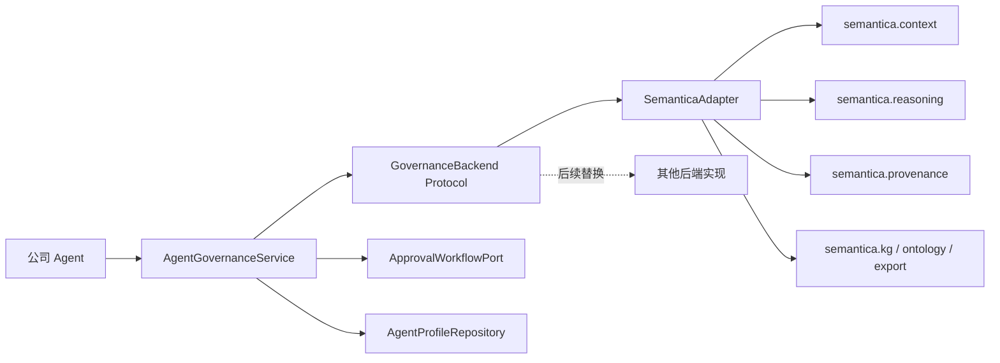
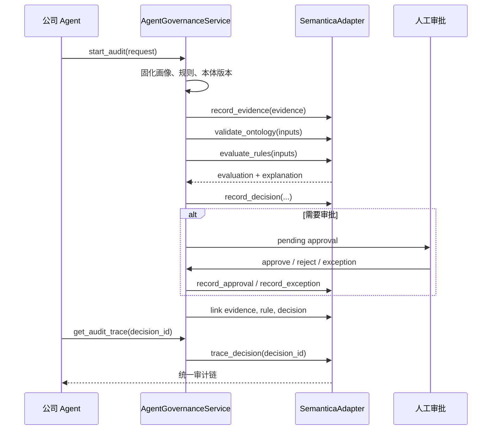

# SemanticaAdapter 设计说明

日期：2026-08-24  
目标版本：Semantica 0.6.6  
项目目录：`semantica-adapter`  
Python 包：`semantica_adapter`

## 1. 背景

公司的 Agent 在执行金额核对、合规检查或其他高风险决策时，通常只留下输入和最终结果，无法稳定回答以下问题：

- 哪个 Agent 执行了审核；
- 当时绑定了哪一版规则和本体；
- 使用了哪些业务数据和证据；
- 哪些规则被触发；
- 决策依据、结果和后续影响是什么；
- 是否经过人工审批或使用了政策例外；
- 数月后能否还原并导出完整审核过程。

Semantica 已提供上下文图、决策智能、确定性推理、来源追踪、知识图谱、本体和审计导出能力。本项目不重新实现 Semantica，而是在公司 Agent 与 Semantica 之间建立一层稳定、供应商无关的业务接口。

## 2. 目标

SemanticaAdapter 第一版必须实现：

1. 公司 Agent 不直接导入或调用 `semantica.*`。
2. 通过统一接口注册 Agent 画像，并绑定规则、本体、数据源和审批策略版本。
3. 将每次审核建模为独立的审计会话。
4. 记录输入、证据、规则命中、系统级解释、决策，并通过 Semantica 的 `ApprovalChain` 和 `PolicyException` 能力记录审批与例外。
5. 使用 Semantica 构建决策图、因果关系和 W3C PROV-O 来源链。
6. 支持查询决策链并导出可离线检查的审计材料。
7. 通过接口契约测试保证将来能够替换 Semantica 实现，而不修改 Agent 业务代码。

## 3. 非目标

第一版不实现：

- 重写 Semantica 的图谱、推理、本体或来源追踪算法；
- 暴露或重构 LLM 的内部思维链；
- 接入 Semantica 的全部采集器、向量数据库和图数据库；
- 完整银行级 RBAC、SSO、HSM、数字签名或不可变存储；
- 通用可视化平台和 Semantica Knowledge Explorer 的复制；
- 自动解释或判断法规本身是否正确。

第一版解释的是 Agent 外部可观察的执行过程，而不是基础模型内部推理。

## 4. 设计原则

### 4.1 优先使用 Semantica 公共接口

适配器优先调用 Semantica 0.6.6 的公共类和方法，不复制其内部实现。确需兼容内部差异时，适配逻辑只存在于 `adapters/semantica/`。

### 4.2 Agent 不感知 Semantica 类型

Agent 只能使用 `semantica_adapter.domain` 中的稳定模型和 `semantica_adapter.ports` 中的协议。`ContextGraph`、`ProvenanceEntry` 等 Semantica 类型不得出现在公共接口参数或返回值中。

### 4.3 失败关闭

缺少必需证据、规则版本、本体版本或出现决策关键事实冲突时，不允许自动通过，结果必须进入 `manual_review`。

### 4.4 规则和来源可复现

决策记录必须保存 Agent 画像版本、规则版本、本体版本、证据摘要和后端版本，不能只保存规则名称或文件路径。

### 4.5 小接口与契约测试

对外提供一个编排服务，对内按职责划分端口。所有后端实现必须通过同一组契约测试。

## 5. 总体架构



职责边界：

- `AgentGovernanceService`：公司业务流程、失败关闭、审批门禁和返回结果编排；
- `GovernanceBackend`：供应商无关的能力接口；
- `SemanticaAdapter`：把稳定领域模型转换为 Semantica 调用，再转换回稳定结果；
- `AgentProfileRepository`：保存 Agent 静态画像和版本；
- `ApprovalWorkflowPort`：连接公司的身份、权限和真实审批流程；第一版可使用受控的内存实现进行集成验证；
- Semantica：负责上下文图、规则检查、决策记录、审批链、政策例外、因果链、来源追踪、本体和导出。

## 6. 第一版引入的 Semantica 能力

| Semantica 模块 | 第一版用途 | 适配器输出 |
|---|---|---|
| `semantica.context` | 决策节点、因果关系、政策检查、决策链、`ApprovalChain`、`PolicyException` | 决策 ID、审批/例外 ID、因果链、决策摘要 |
| `semantica.reasoning` | 确定性规则计算和可解释步骤 | 规则命中、结论、解释步骤 |
| `semantica.provenance` | 证据和事实来源追踪 | 来源链、版本和实体血缘 |
| `semantica.kg` | 实体、事实和关系图 | 供应商无关的节点与边 |
| `semantica.ontology` | 字段、本体和 SHACL 约束 | 校验结果和错误列表 |
| `semantica.export` | JSON、CSV、RDF/PROV-O 导出 | 导出文件和内容摘要 |

以下能力延后按需接入：

- `ingest`、`parse`、`normalize`、`split`、`semantic_extract`：处理非结构化制度和业务材料；
- `conflicts`、`deduplication`：多系统事实融合；
- `vector_store`、`embeddings`：相似决策和先例检索；
- `visualization`、`explorer`：人工审计工作台；
- 外部图数据库、三元组库和企业数据平台连接器。

## 7. 领域模型

### 7.1 AgentProfile

Semantica 的 `AgentContext`、`AgentMemory` 和决策历史可以形成 Agent 的动态上下文，但源码中没有独立、版本化的 `AgentProfile` 注册模型。`AgentProfile` 因此属于本适配层的最小业务补充，用于固定 Agent 与规则、本体、数据源及审批策略的绑定关系；其运行时上下文和决策历史仍交由 Semantica 保存。

- `agent_id`
- `name`
- `purpose`
- `profile_version`
- `rule_set_id` / `rule_set_version`
- `ontology_id` / `ontology_version`
- `allowed_source_types`
- `approval_policy`
- `metadata`

### 7.2 AuditRequest

- `request_id`
- `agent_id`
- `task_type`
- `inputs`
- `evidence`
- `requested_at`
- `correlation_id`

### 7.3 EvidenceRef

- `evidence_id`
- `source_type`
- `source_uri`
- `content_hash`
- `observed_at`
- `metadata`

默认不在领域对象中重复保存大文件内容，只保存受控引用、摘要和必要元数据。

### 7.4 RuleEvaluation

- `rule_set_id` / `rule_set_version`
- `matched_rules`
- `conclusions`
- `explanation_steps`
- `missing_fields`
- `conflicts`

### 7.5 DecisionRecord

- `decision_id`
- `audit_id`
- `agent_id` / `profile_version`
- `category`
- `scenario`
- `outcome`
- `reasoning_summary`
- `confidence`
- `evidence_ids`
- `rule_evaluation`
- `backend_name` / `backend_version`
- `created_at`

`reasoning_summary` 只保存可公开的系统级依据，不要求或保存 LLM 私有思维链。

### 7.6 ApprovalRecord 与 PolicyException

Semantica 已提供 `ApprovalChain`、`PolicyException`、`DecisionRecorder.record_approval_chain()`、`DecisionRecorder.record_exception()` 和 `PolicyEngine.record_exception()`。实际兼容测试发现 0.6.6 的 recorder 在内存 `ContextGraph` 下无法保留调用方 ID，审批路径还假设存在 `execute_query()`。因此 v1 仍映射到 Semantica 公共模型，但通过 `ContextGraph.add_node/add_edge` 公共 API 保存节点和关系；不调用私有 API，也不复制 Semantica 算法。后续上游接口修复后只替换该兼容分支。

稳定领域模型仍使用 `ApprovalRecord` 和 `PolicyException`，用于隔离 Semantica 类型并补充银行业务所需字段。适配器负责把它们映射到 Semantica 对象；无法直接映射的有效期、角色、动作和补偿控制保存在受控 metadata 中。

公司层只负责 Semantica 当前没有覆盖的流程控制：审批人身份认证、角色权限、待审批/通过/拒绝状态机、双人复核、职责分离和审批系统连接。它不得重复实现 Semantica 已有的审批与例外记录能力。

### 7.7 AuditTrace 与 AuditExport

`AuditTrace` 返回从 Agent 画像、规则、本体、证据、事实、决策到审批的有序链。`AuditExport` 返回导出格式、文件位置、哈希和生成时间。

## 8. 公共服务接口

公司 Agent 只调用 `AgentGovernanceService`：

```python
service.register_agent(profile)
audit = service.start_audit(request)
evaluation = service.evaluate(audit.audit_id)
decision = service.record_decision(audit.audit_id, proposed_outcome)
service.submit_approval(decision.decision_id, approval)
trace = service.get_audit_trace(decision.decision_id)
export = service.export_audit(decision.decision_id, format="json")
```

行为约束：

- `start_audit` 固化当前 Agent 画像、规则和本体版本；
- `evaluate` 只执行确定性治理规则，不要求调用 LLM；
- `record_decision` 必须引用已记录证据和规则计算结果；
- 若审批策略要求人工确认，审批完成前决策状态不得为最终生效；
- `get_audit_trace` 返回稳定领域模型，不返回 Semantica 原始对象；
- `export_audit` 必须包含内容哈希和后端版本。

## 9. 可替换后端接口

`GovernanceBackend` 至少定义：

- `capabilities()`
- `register_profile_snapshot()`
- `record_evidence()`
- `validate_ontology()`
- `evaluate_rules()`
- `record_decision()`
- `record_approval()`
- `record_exception()`
- `link_decisions()`
- `trace_decision()`
- `export_decision()`
- `health_check()`

每个方法使用领域模型。暂不支持的可选能力必须通过 `capabilities()` 明确报告，不允许静默忽略。

`SemanticaAdapter` 是第一版 `GovernanceBackend` 实现。测试使用 `FakeGovernanceBackend` 验证业务服务不依赖 Semantica。

## 10. Semantica 映射

| 后端接口 | Semantica 0.6.6 映射 |
|---|---|
| `record_decision` | `ContextGraph.record_decision()` |
| `record_approval` | `ApprovalChain` 映射 + `ContextGraph` 公共 API（0.6.6 兼容分支） |
| `record_exception` | `PolicyException` 映射 + `ContextGraph` 公共 API（0.6.6 兼容分支） |
| `link_decisions` | `ContextGraph.add_causal_relationship()` |
| `trace_decision` | `ContextGraph.trace_decision_chain()` 及来源管理器 |
| `evaluate_rules` | `semantica.reasoning` 与 `ContextGraph.check_decision_rules()` |
| `record_evidence` | `ProvenanceManager.track_entity()` |
| `validate_ontology` | `OntologyEngine.validate_graph()` / `OntologyValidator` |
| `export_decision` | Semantica JSON、CSV、RDF/PROV-O exporter |

适配器必须固定并报告 Semantica 版本。第一版以 `semantica==0.6.6` 为兼容基线。

## 11. 审核流程



## 12. 错误处理

公共异常分为：

- `ConfigurationError`：Semantica 或存储配置错误；
- `UnsupportedCapabilityError`：后端不支持请求能力；
- `ValidationError`：输入、本体或规则校验失败；
- `EvidenceError`：证据缺失、摘要不一致或不可访问；
- `BackendError`：Semantica 调用失败；
- `AuditIntegrityError`：审计链或导出摘要校验失败；
- `ApprovalRequiredError`：调用方试图绕过审批门禁。

后端异常不得原样泄漏到 Agent；适配器转换为稳定异常并保留内部错误链用于日志。缺证据、缺规则字段、规则冲突和本体失败均采用失败关闭策略。

## 13. 安全与合规边界

- 默认自托管，不把银行数据发送到未配置的外部服务；
- 只允许显式配置的数据源和导出目录；
- 日志不记录证件号、账号、完整原文等敏感信息；
- 证据引用保存哈希，敏感正文由公司受控存储管理；
- Agent 不能自行创建审批通过记录；公司审批端确认后才允许调用 Semantica 审批链记录能力；
- 每条审批和例外记录包含操作者身份及时间；
- 第一版哈希提供完整性检测，不声称具备不可抵赖性；
- 生产前仍需接入公司身份、权限、密钥和不可变存储体系。

## 14. 目标目录结构

```text
semantica-adapter/
├── pyproject.toml
├── README.md
├── src/
│   └── semantica_adapter/
│       ├── __init__.py
│       ├── api/
│       │   └── service.py
│       ├── domain/
│       │   ├── models.py
│       │   └── errors.py
│       ├── ports/
│       │   ├── backend.py
│       │   ├── profiles.py
│       │   └── approvals.py
│       ├── services/
│       │   └── governance.py
│       ├── adapters/
│       │   ├── semantica/
│       │   │   ├── backend.py
│       │   │   ├── mapping.py
│       │   │   └── config.py
│       │   └── memory/
│       │       ├── profiles.py
│       │       └── approvals.py
│       └── config/
│           └── settings.py
├── tests/
│   ├── contract/
│   ├── unit/
│   └── integration/
├── examples/
├── docs/
└── legacy/
    └── auditgraph/              # 迁移验收前保留，排除在发布包之外
```

## 15. 现有 AuditGraph 迁移

1. 将项目目录从 `auditgraph-main` 调整为 `semantica-adapter`；
2. 改为标准 `src/semantica_adapter` 布局；
3. 保留现有审批门禁、审计摘要、完整性验证和失败关闭测试中可复用的领域逻辑；审批及政策例外的图记录改为调用 Semantica 现有能力；
4. 将不再使用的轻量重复实现移动到 `legacy/auditgraph/`，排除在发布包之外；迁移验收前不删除；
5. 由 `SemanticaAdapter` 调用本地 Semantica 0.6.6；
6. 迁移后的测试首先验证公共接口，不依赖 Semantica 内部对象结构；
7. 原项目在迁移验证完成前不做不可恢复删除。

## 16. 测试策略

### 单元测试

- 领域模型校验；
- 失败关闭规则；
- 审批门禁；
- Semantica 类型与领域类型映射；
- 异常转换和敏感日志过滤。

### 契约测试

同一组测试分别运行于 `FakeGovernanceBackend` 和 `SemanticaAdapter`，验证：

- 证据可以追溯；
- 规则计算有解释步骤；
- 决策绑定 Agent 和版本；
- 因果链可以查询；
- 缺少决策事实不会自动通过；
- 导出结果可验证。

### 集成测试

- 使用 Semantica 0.6.6 运行完整审计流程；
- 使用结构化金额核对数据作为第一条验收样例；
- 验证无人工审批时不能完成要求审批的决策；
- 验证替换为 Fake 后端后 Agent 调用代码不变。

## 17. 第一版验收标准

第一版完成必须同时满足：

1. 示例 Agent 代码中没有 `import semantica`；
2. Agent 只通过 `AgentGovernanceService` 完成审核；
3. `SemanticaAdapter` 使用 Semantica 0.6.6 记录决策、规则结果和来源；
4. 审计链可还原 Agent、画像版本、规则版本、证据、决策和审批；
5. 缺证据、冲突或本体不合规会进入人工复核；
6. 审计材料至少支持 JSON 和 RDF/PROV-O；
7. Fake 后端与 Semantica 后端通过相同接口契约测试；
8. 现有 AuditGraph 的关键安全回归测试迁移后继续通过。

## 18. 后续扩展

完成第一版后，再按业务需求接入：

- 文件和制度文档采集、解析及语义抽取；
- 冲突检测和实体去重；
- 相似决策及先例搜索；
- 图谱可视化和审计工作台；
- 公司统一身份、RBAC 和审批系统；
- 持久图数据库及不可变审计存储；
- REST、MCP 或公司 Agent 平台原生连接器。
