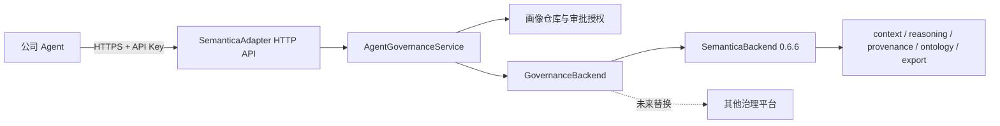

# SemanticaAdapter HTTP 服务化设计

## 目标

把 SemanticaAdapter 从“与 Agent 运行在同一 Python 进程中的 SDK”扩展为可独立部署的治理服务。公司 Agent 只依赖稳定 HTTP API，不安装也不导入 Semantica；服务端通过现有 `GovernanceBackend` 使用 Semantica 0.6.6，未来替换后端时不修改 Agent 调用代码。

## 方案比较

### 方案一：每个 Agent 直接安装 Semantica

改动最小，但每个 Agent 都与 Semantica Python API、依赖版本和运行时绑定。升级、隔离、权限控制和统一审计较困难，不适合作为公司级接入方式。

### 方案二：Agent 直接调用 Semantica 官方 REST API

减少本地依赖，但 Semantica 0.6.6 的官方 REST 路由没有完整覆盖本项目的版本化 Agent 画像、人工审批、政策例外、决策级审计包和完整性清单。Agent 还会直接依赖上游接口，后续替换治理平台时需要改业务代码。

### 方案三：SemanticaAdapter 提供稳定 HTTP API（采用）

Agent 调用 SemanticaAdapter；SemanticaAdapter 负责公司治理语义、鉴权、失败关闭和审计包；内部再调用 `GovernanceBackend`。这与老师提出的“做一层接口封装，后续只替换接口实现”一致。

## 架构

## 依赖边界

- 基础安装包含领域模型和 HTTP 客户端，依赖 `httpx`，不依赖 `semantica`。
- `semantica` extra 提供进程内 Semantica 后端。
- `server` extra 提供 FastAPI、Uvicorn 和 Semantica 后端。
- `create_local_semantica_service()` 使用函数内惰性导入，保证基础包在未安装 Semantica 时仍可导入。
- 固定支持 Semantica `0.6.6`，删除 `../semantica-main` 路径覆盖和测试路径注入。

## HTTP API

所有 `/v1` 端点都要求 `X-API-Key`；`/health` 不要求认证，供容器和负载均衡器探活。

| 方法 | 路径 | 功能 |
|---|---|---|
| `GET` | `/health` | 服务和后端健康检查 |
| `POST` | `/v1/agents` | 注册版本化 Agent 画像 |
| `POST` | `/v1/audits` | 创建审计并记录证据 |
| `POST` | `/v1/audits/{audit_id}/evaluate` | 执行本体校验和确定性规则 |
| `POST` | `/v1/audits/{audit_id}/decisions` | 固化决策及依据 |
| `POST` | `/v1/approvals` | 提交人工审批 |
| `POST` | `/v1/exceptions` | 记录政策例外 |
| `GET` | `/v1/decisions/{decision_id}/trace` | 查询完整审计链 |
| `POST` | `/v1/decisions/{decision_id}/audit-package` | 下载 ZIP 审计包 |

数据格式使用已有领域模型的字段名。时间统一为带时区 ISO 8601 字符串，枚举使用其字符串值，元组在 JSON 中表示为数组。

## HTTP 客户端

`SemanticaHttpClient` 提供与治理生命周期同名的方法，并把 JSON 转回稳定领域模型。客户端支持自定义超时和注入 `httpx.Client`，便于企业网关配置及测试。非 2xx 响应转换为稳定异常；连接失败、超时和无法解析的响应转换为 `BackendError`。

审计包由服务端生成 ZIP，并在 `X-Content-SHA256` 返回摘要。客户端下载后先校验摘要，再原子写入调用方指定路径，避免把半包或篡改包交给 Agent。

## 服务端配置与安全

- `SEMANTICA_ADAPTER_API_KEY` 必填；未配置时拒绝启动。
- `SEMANTICA_ADAPTER_AUTHORIZED_ACTORS` 是 JSON 二维数组，每项为 `[actor_id, role]`。
- `SEMANTICA_ADAPTER_PROVENANCE_PATH` 指定 Semantica 来源数据库路径。
- `SEMANTICA_ADAPTER_HOST` 默认 `127.0.0.1`，避免未配置鉴权和 TLS 网关时暴露到网络。
- `SEMANTICA_ADAPTER_PORT` 默认 `8001`。
- API Key 使用常量时间比较；错误响应不返回内部堆栈。
- 银行生产环境应在服务前部署 TLS/mTLS、SSO/RBAC、密钥托管、限流和访问审计。本阶段不把这些企业基础设施伪装成已完成能力。

## 错误处理

- 参数和生命周期校验错误：HTTP 422。
- 未认证：HTTP 401。
- 未授权审批或绕过审批：HTTP 403。
- 未找到审计或决策：HTTP 404。
- Semantica 后端失败：HTTP 502。
- 未预期异常：HTTP 500，响应仅包含通用错误信息。

客户端根据状态码恢复为 `ValidationError`、`ApprovalRequiredError` 或 `BackendError`，保证 Agent 不依赖 FastAPI 或 Semantica 异常类型。

## 测试检查点

1. 基础包隔离：阻止 `semantica` 导入时仍能导入 `semantica_adapter`。
2. Wire 格式：所有领域模型完成 JSON 往返，时间、枚举和路径类型正确。
3. HTTP 服务：使用内存后端跑通金额核对全生命周期，并验证鉴权和失败关闭。
4. HTTP 客户端：验证请求路径、认证头、响应解码、错误映射和审计包哈希。
5. Semantica 集成：从 PyPI 安装 0.6.6 后执行真实后端测试，不读取 `../semantica-main`。
6. 发布检查：完整测试、编译、构建 wheel，并检查 wheel 不包含 `legacy`、输出目录或缓存文件。

## 与 short-term-memory 的关系

两个项目继续作为独立服务和独立仓库。Agent 在生成模型上下文时调用 `short-term-memory`，在做受规则约束的业务决策时调用 SemanticaAdapter；未来可在单独的 Agent 集成项目中编排两者，不合并源码和发布生命周期。

