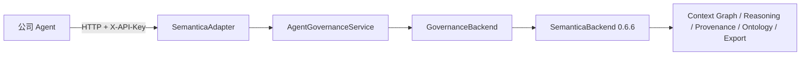

# SemanticaAdapter 使用与功能定位

本文面向需要运行、验收或继续开发本项目的老师和工程人员。README 解释项目价值和总体流程；本文进一步拆解每项已实现功能，给出 HTTP 入口、核心源码和对应测试，方便从功能直接定位到代码。

## 1. 部署关系



Agent 侧只需要本项目的基础包和 `httpx`，不安装 Semantica。服务端使用 `server` extra，从 PyPI 安装固定版本 `semantica==0.6.6`。

## 2. 安装与启动

克隆仓库后执行：

```bash
cd semantica-adapter
uv sync --extra server
```

配置运行环境：

```bash
export SEMANTICA_ADAPTER_API_KEY='通过密钥管理系统注入的随机密钥'
export SEMANTICA_ADAPTER_AUTHORIZED_ACTORS='[["risk-manager","reviewer"]]'
export SEMANTICA_ADAPTER_PROVENANCE_PATH='runtime-state/provenance.db'
export SEMANTICA_ADAPTER_HOST='127.0.0.1'
export SEMANTICA_ADAPTER_PORT='8001'
```

启动并探活：

```bash
uv run semantica-adapter-server
curl http://127.0.0.1:8001/health
```

除 `/health` 外，所有接口都要求请求头：

```text
X-API-Key: <由密钥系统提供>
```

## 3. 功能—接口—源码—测试定位表

| 功能 | HTTP 入口 | 核心实现 | Semantica 映射 | 主要测试 |
|---|---|---|---|---|
| Agent 画像注册与版本绑定 | `POST /v1/agents` | `domain/models.py::AgentProfile`、`services/governance.py::register_agent` | 画像快照写入 Context Graph | `tests/unit/test_memory_ports.py`、`tests/integration/test_http_app.py` |
| 创建审计和记录证据 | `POST /v1/audits` | `services/governance.py::start_audit` | `record_profile_snapshot`、`record_evidence`、PROV-O | `tests/unit/test_governance_service.py`、`tests/integration/test_semantica_backend.py` |
| 本体与字段验证 | `POST /v1/audits/{id}/evaluate` | `services/governance.py::evaluate` | `semantica.ontology.OntologyValidator` | `tests/unit/test_governance_service.py` |
| 确定性规则推理 | 同上 | `GovernanceBackend.evaluate_rules` | `semantica.reasoning.Reasoner` | `tests/integration/test_semantica_backend.py` |
| 失败关闭与强制转人工 | 同上 | `services/governance.py::evaluate` | 推理结论映射 | `tests/unit/test_governance_service.py` |
| 固化决策和依据 | `POST /v1/audits/{id}/decisions` | `services/governance.py::record_decision` | `ContextGraph`、`DecisionRecorder` | `tests/integration/test_http_app.py` |
| 人工审批授权 | `POST /v1/approvals` | `services/governance.py::submit_approval`、`ports/approvals.py` | `ApprovalChain` 与图节点 | `tests/unit/test_governance_service.py` |
| 政策例外与补偿控制 | `POST /v1/exceptions` | `services/governance.py::record_exception` | `PolicyException` 与图节点 | `tests/unit/test_governance_service.py` |
| 查询完整审计链 | `GET /v1/decisions/{id}/trace` | `GovernanceBackend.trace_decision` | Context Graph 作用域查询 | `tests/integration/test_semantica_backend.py` |
| JSON/RDF/PROV-O 导出 | 审计包接口内部执行 | `SemanticaBackend.export_decision` | `semantica.export`、`semantica.provenance` | `tests/integration/test_semantica_backend.py` |
| manifest 与哈希链 | `POST /v1/decisions/{id}/audit-package` | `services/integrity.py` | 适配层完整性能力 | `tests/integration/test_integrity.py` |
| ZIP 下载与客户端校验 | 同上 | `http/client.py::download_audit_package` | 不依赖 Semantica | `tests/unit/test_http_client.py` |
| HTTP 鉴权与错误隔离 | 所有 `/v1` 接口 | `http/app.py` | 不向 Agent 暴露 Semantica 异常 | `tests/integration/test_http_app.py` |
| HTTP 领域模型转换 | 所有接口 | `http/wire.py` | Semantica 对象不会跨边界 | `tests/unit/test_http_wire.py` |
| 后端可替换契约 | 服务内部 | `ports/backend.py::GovernanceBackend` | 当前实现为 `SemanticaBackend` | `tests/contract/test_backend_contract.py` |

以上路径均相对于项目根目录 `semantica-adapter/`。

## 4. HTTP 调用顺序

一次金额核对的标准顺序为：

```text
register_agent
  → start_audit
  → evaluate
  → record_decision
  → record_exception（仅在需要且仍待审批时）
  → submit_approval（仅在待审批时）
  → get_audit_trace
  → download_audit_package
```

不能跳过 `evaluate` 直接记录决策。缺字段、无证据、本体错误、事实冲突、未授权来源或不利规则结论都会强制转为人工复核，Agent 提议的“通过”结果不能覆盖该状态。

## 5. Python Agent 示例

```python
import os
from pathlib import Path

from semantica_adapter.http import SemanticaHttpClient

client = SemanticaHttpClient(
    "http://127.0.0.1:8001",
    api_key=os.environ["SEMANTICA_ADAPTER_API_KEY"],
)
client.register_agent(profile)
audit = client.start_audit(request)
evaluated = client.evaluate(audit.audit_id)
decision = client.record_decision(
    evaluated.audit_id,
    proposed_outcome="matched",
    reasoning_summary="申报金额与总账金额比较结果",
    confidence=1.0,
)
trace = client.get_audit_trace(decision.decision_id)
package = client.download_audit_package(
    decision.decision_id,
    Path("downloads") / "audit-package.zip",
)
client.close()
```

完整的领域模型构造和银行金额核对数据见 `examples/amount_reconciliation.py`；HTTP 全流程请求和响应见 `tests/integration/test_http_app.py`。

## 6. 配置项

| 环境变量 | 必填 | 默认值 | 说明 |
|---|---:|---|---|
| `SEMANTICA_ADAPTER_API_KEY` | 是 | 无 | HTTP API Key；未配置时拒绝启动 |
| `SEMANTICA_ADAPTER_AUTHORIZED_ACTORS` | 否 | `[]` | 可审批人员与角色的 JSON 二维数组 |
| `SEMANTICA_ADAPTER_PROVENANCE_PATH` | 否 | 内存/后端默认 | Semantica provenance SQLite 路径 |
| `SEMANTICA_ADAPTER_HOST` | 否 | `127.0.0.1` | 监听地址 |
| `SEMANTICA_ADAPTER_PORT` | 否 | `8001` | 监听端口 |

生产环境不应把明文密钥写进仓库或 `.env`；应由 Vault、KMS、Kubernetes Secret 或公司的密钥平台注入。

## 7. 测试与验收定位

```bash
uv sync --extra server
uv run python -m pytest -q
uv run python -m compileall -q src tests examples
```

重点验收：

- HTTP 服务：`tests/integration/test_http_app.py`
- HTTP 客户端：`tests/unit/test_http_client.py`
- PyPI Semantica 真实集成：`tests/integration/test_semantica_backend.py`
- 金额核对端到端：`tests/integration/test_amount_reconciliation.py`
- 审计包防篡改：`tests/integration/test_integrity.py`
- 失败关闭和审批门禁：`tests/unit/test_governance_service.py`

## 8. 与 short-term-memory 的组合方式

`short-term-memory` 管理对话上下文、压缩、历史恢复和原文召回；SemanticaAdapter 管理业务决策、规则、审批与审计。二者保持独立服务：

```text
Agent 调用 short-term-memory.prepare() 准备模型上下文
  → Agent/LLM 产生业务审核候选结果
  → Agent 调用 SemanticaAdapter 执行确定性规则和治理流程
  → Agent 把最终答复写回 short-term-memory
```

这种方式既能组合使用，又不会把两个项目的依赖、状态存储、测试和发布周期耦合在一起。

## 9. 当前生产边界

当前 HTTP 服务已经提供 API Key、错误隔离和审计包校验，但画像、审计会话和审批工作流仍使用进程内实现。银行生产化还需要接入持久数据库、SSO/RBAC、职责分离、TLS/mTLS、限流、集中日志、HSM 签名、WORM 存储、备份恢复和监管留存策略。
