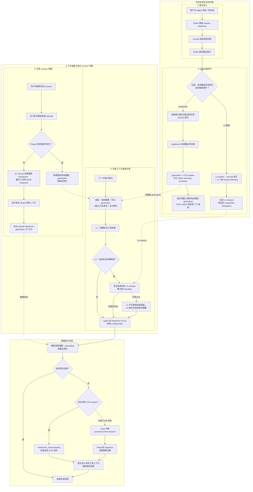

# short-term-memory

`short-term-memory` 是一个面向大模型与 AI Agent 的短期记忆管理模块，以独立 HTTP 服务形式运行。

它使用 Redis 保存当前 session 的在线上下文，包括最近消息、Headroom generation、连续性摘要和压缩状态；使用 Journal JSONL 持久保存完整原始事件，并保存可用于历史 session 恢复的不可变压缩检查点。

每次 Agent 调用模型前，服务会根据当前上下文状态依次执行微压缩、自动压缩判断、Session Memory 快速压缩和传统连续性压缩。较早内容可以被摘要反复覆盖，最近完整对话轮次继续按原文保留，从而让长会话持续运行，而不是让历史内容不断占满模型窗口。

用户切换回历史 session 时，Agent 会在写入新问题前先激活该 session。若 Redis 已过期，服务从 Journal 恢复最新压缩摘要、最近 N 轮原文和历史 sequence，并在后台重建 Headroom generation 与 CCR 召回入口。

| 职责 | 实现 |
|---|---|
| 在线短期上下文 | Redis Session Projection |
| 完整原始记录 | Journal JSONL |
| 请求级微压缩 | L1 Micro Compact |
| 自动压缩调度 | L2 Auto Compact |
| 结构化会话记忆 | L4 Session Memory |
| 递归连续性摘要 | L3 Traditional Compact |
| 细节压缩 | Headroom generation |
| 精确原文召回 | Headroom CCR + Journal Grep/Read |
| 历史 session 恢复 | compaction checkpoint + 最近 N 轮 |
| 最终回答 | Agent 自己的 LLM/provider |

Headroom 只压缩并转发 Agent 当前要发送给模型的上下文，同时提供 generation 和 CCR；它不拥有、也不替换 Redis 中的当前 session 上下文。当前上下文的覆盖边界、摘要版本、最近原文和历史恢复均由 `short-term-memory` 管理。

## 架构

下图按功能分区展示正常写入、递进压缩、历史 session 冷恢复和精确原文召回。各分区横向展开，避免把完整流程画成细长单链。



一次完整的 Agent 调用顺序是：

```text
activate → write(user) → prepare → model/tool loop → write(assistant)
```

- `activate` 必须发生在新消息写入之前，保证历史 sequence 连续。
- `write` 采用 Journal-first，原文持久化后才提交 Redis。
- `prepare` 返回本次真正要发给模型的有界上下文和召回工具。
- 模型根据摘要与 marker 自主决定是否召回细节，用户不需要手动操作。
- assistant 消息写入后，后台任务继续维护 Session Memory 和 Headroom generation。

## 依赖与调用方式

| 组件 | 版本/形式 | 作用 | 部署位置 |
|---|---|---|---|
| short-term-memory | Python package `0.1.0` | 上下文编排、压缩、恢复、HTTP 工具 | 独立 HTTP 服务 |
| Redis Server | 外部服务 | 当前 session、压缩 envelope、队列和租约 | 独立进程/容器 |
| redis-py | `6.4.0` | Redis 连接池、事务和 Lua 原子操作 | 记忆服务进程 |
| Headroom | 独立 HTTP/Proxy 服务 | generation 压缩、Proxy、CCR | 独立进程/容器 |
| ContinuityCompactionModel | 可注入 adapter | L3/L4 独立 compact 请求 | 与 Agent 相同 provider |
| 最终 LLM/Agent | 调用方实现 | 使用准备后的上下文生成回答 | Agent 系统 |

Agent 与 Journal 不需要位于同一台机器或同一容器。Agent 只通过 HTTP 调用记忆服务，并通过受 session scope 约束的 `journal://current-session` 工具访问当前 session 的逻辑 transcript。

### Redis 是怎么调用的

Redis Server 独立部署。服务通过异步 redis-py 客户端和 Lua 脚本保证 sequence、幂等写、envelope CAS、历史恢复与租约操作的原子性。

| 场景 | Redis 操作 |
|---|---|
| 为事件分配 sequence | Lua reserve-event |
| 提交用户/助手消息 | Lua commit-event |
| 读取最近原文 | `LRANGE` |
| 读取压缩 envelope | `GET` |
| 并发更新压缩状态 | version CAS Lua |
| 裁剪已覆盖原文 | trim-originals Lua，保留最近 token 预算 |
| 历史 session 冷恢复 | restore-session-projection Lua |
| CCR hash→摘要索引 | `HSET` / `HGETALL` |
| 压缩与激活互斥 | Redis lease |

Redis 是在线投影，可以按 TTL 过期；Journal 才是可重建的持久事实源。

### Headroom 是怎么调用的

Headroom 作为独立 HTTP/Proxy 服务运行，调用分为三条路径：

1. **后台 generation 压缩**：worker 向 `/v1/compress` 发送离开最近原文保护区的原始消息。返回结果作为不透明 `CompressionGeneration` 写入 Redis envelope。
2. **真实模型请求**：`prepare` 返回 Proxy URL 和去标识化 scope headers，Agent 将实际模型请求发往该 Proxy。
3. **CCR 原文召回**：模型产生 `headroom_retrieve` 工具调用后，Agent 按 marker hash 调用 `/v1/memories/recall`，再把原文工具结果交回同一个模型。

Headroom 输入只包含原文，不包含 L3/L4 摘要或旧 generation。已被活动摘要覆盖的 generation 不再进入 prompt，但其 marker 在有效期内仍可用于 CCR 召回。

### ContinuityCompactionModel 是怎么调用的

`ContinuityCompactionModel` 由部署层注入，使用与 Agent 相同的 LLM/provider，但发起独立、单轮、无工具的 compact 请求：

- L4 在后台更新结构化 Session Memory，不阻塞正常模型请求。
- L3 仅在 `prepare` 达到压缩阈值且 L4 无法把上下文降到安全范围时执行。
- compact 请求有独立超时和模型名配置，不复用当前回答请求。
- 只有输出校验成功且 Redis envelope CAS 成功后，才推进覆盖 sequence。

## 项目结构

```text
.
├── src/short_term_memory/
│   ├── __init__.py
│   ├── cli.py                              # API / worker 进程入口
│   ├── config.py                           # 环境变量与运行设置
│   ├── models.py                           # 事件、generation、revision、boundary
│   ├── ports.py                            # 外部依赖 Protocol
│   ├── agent/
│   │   └── agent_chat.py                   # activate/write/prepare/tool loop 编排
│   ├── compression/
│   │   ├── micro_compact.py                # L1 请求级微压缩
│   │   ├── auto_compact.py                 # L2 阈值、buffer 与断路器
│   │   ├── session_memory.py               # L4 Session Memory 更新
│   │   ├── session_memory_state.py         # L4 更新条件与状态
│   │   ├── session_memory_compact.py       # L4 快速压缩与安全保尾
│   │   ├── traditional_compact.py          # L3 递归连续性压缩
│   │   ├── compact_prompt.py               # 连续性摘要格式
│   │   ├── context_query.py                # 摘要替换与活动上下文组装
│   │   ├── continuity_model.py             # 可注入 compact model adapter
│   │   ├── generations.py                  # Headroom generation 选择与覆盖
│   │   ├── async_headroom_client.py        # Headroom HTTP adapter
│   │   └── ccr_recall.py                   # CCR marker 原文召回
│   ├── service/
│   │   ├── app.py                          # FastAPI 路由
│   │   ├── memory_service.py               # write/read/recall/transcript 业务
│   │   ├── context_coordinator.py          # prepare 的 L1→L2→L4/L3 编排
│   │   ├── session_activation.py           # 历史 session 有界恢复
│   │   ├── runtime.py                      # 服务依赖组装
│   │   └── schemas.py                      # HTTP 请求/响应模型
│   ├── storage/
│   │   ├── async_redis_memory_store.py     # Redis 原子操作与 CAS
│   │   ├── compaction_checkpoint.py        # 不可变 L3/L4 检查点
│   │   ├── journal_store.py                # Journal 追加与恢复查询
│   │   ├── recent_originals.py             # 最近完整轮次选择
│   │   └── vfs_adapter.py                  # 用户隔离目录
│   ├── transcript/
│   │   ├── journal_transcript.py           # 跨日期逻辑 transcript
│   │   ├── grep_tool.py                    # session 内正则定位
│   │   ├── read_tool.py                    # sequence 精确读取
│   │   └── tool_definitions.py             # 模型工具定义
│   └── jobs/
│       ├── compression_worker.py           # generation 压缩与冷重建
│       ├── redis_compression_queue.py      # 持久压缩队列
│       ├── session_memory_worker.py        # L4 后台 worker
│       └── session_memory_queue.py         # L4 持久队列
├── examples/
├── tests/
├── compose.redis.yml
├── compose.memory.yml
├── .env.example
└── pyproject.toml
```

## 快速开始

### 1. 获取并安装项目

要求 Python 3.11–3.13、Redis、Headroom 和 `uv`。

```bash
# 从 hzbank-internship 成果仓库根目录进入本项目
cd short-term-memory
uv sync --extra api --extra deepseek --extra dev
```

### 2. 启动 Redis

```bash
docker compose -f compose.redis.yml up -d
docker compose -f compose.redis.yml exec redis redis-cli ping
```

预期返回 `PONG`。

### 3. 启动 Headroom

Headroom 使用独立环境运行，不安装进本项目 Python 环境。启动服务后，将根 URL 写入 `HEADROOM_SERVICE_URL`。后台 generation 压缩、真实模型 Proxy 和 CCR 必须使用同一 session scope。

### 4. 创建配置

```bash
cp .env.example .env
```

最小开发配置：

```dotenv
SHORT_TERM_MEMORY_ENV=development
SHORT_TERM_MEMORY_HOME=~/.dream
SHORT_TERM_MEMORY_SCOPE_SECRET=development-only-scope-secret
REDIS_URL=redis://127.0.0.1:6379/0
HEADROOM_SERVICE_URL=http://127.0.0.1:8787
CONTINUITY_COMPACTION_ENABLED=true
CONTINUITY_COMPACTION_MODEL=deepseek-v4-flash
```

生产环境必须显式配置 `SHORT_TERM_MEMORY_SCOPE_SECRET`、`HEADROOM_SERVICE_URL` 和 API 认证信息。

### 5. 启动 HTTP 服务与 worker

```bash
uv run short-term-memory-api
uv run short-term-memory-worker
```

```bash
curl http://127.0.0.1:8080/health
curl http://127.0.0.1:8080/ready
```

### 6. 接入 Agent

推荐使用 `AgentChatClient`：

```python
from short_term_memory import AgentChatClient

client = AgentChatClient(
    memory_api_url="http://127.0.0.1:8080",
    model_call=model_call,
    auth_token="...",
    context_window_tokens=128_000,
    max_output_tokens=8_192,
)

answer = await client.turn(
    "user-001",
    "session-001",
    "继续之前的任务",
    history_turns=10,
)
```

`AgentChatClient.turn()` 自动完成：

```text
激活 session
  → 写入用户消息
  → 准备有界上下文
  → 调用模型
  → 执行 headroom_retrieve / Grep / Read
  → 将工具结果交回模型
  → 写入最终回答
```

`model_call` 是可注入的异步 provider adapter。Agent 仍然负责真正的模型调用，记忆服务不生成最终回答。

## 核心接口

所有业务接口在 production 均需 `Authorization: Bearer <MEMORY_API_AUTH_TOKEN>`。

| 方法 | 路径 | 作用 |
|---|---|---|
| POST | `/v1/memories/activate` | 写入前激活当前或历史 session |
| POST | `/v1/memories/write` | 幂等写入原始事件并调度后台任务 |
| POST | `/v1/memories/read` | 读取在线上下文或历史压缩视图 |
| POST | `/v1/memories/prepare` | 执行请求级压缩并返回模型上下文与工具 |
| POST | `/v1/memories/recall` | 按 CCR marker hash 召回原文 |
| POST | `/v1/memories/transcript/grep` | 在当前 session Journal 中定位原文 |
| POST | `/v1/memories/transcript/read` | 按 sequence 范围读取精确原文 |
| GET | `/health` | 进程存活检查 |
| GET | `/ready` | Redis、Journal、Headroom 就绪检查 |
| GET | `/metrics` | Prometheus 指标 |

### 激活 session：`POST /v1/memories/activate`

```json
{
  "user_id": "u-001",
  "session_id": "s-old",
  "history_turns": 10
}
```

```json
{
  "request_id": "req-xxx",
  "recovered": true,
  "latest_sequence": 180,
  "checkpoint_id": "sha256:...",
  "rebuild_queued": true
}
```

该接口必须在任何新写入之前调用。热 session 走幂等快速路径；Redis 已过期时执行有界恢复。`latest_sequence` 保证下一条消息从正确 sequence 继续，`rebuild_queued=true` 表示 Headroom 冷重建已经进入后台队列。

### 写记忆：`POST /v1/memories/write`

```json
{
  "user_id": "u-001",
  "session_id": "s-001",
  "session_seconds": 120,
  "events": [
    {
      "event_id": "evt-001",
      "role": "user",
      "content_type": "conversation",
      "content": "继续刚才的问题",
      "metadata": {}
    }
  ]
}
```

`event_id` 是幂等键。事件先追加到 Journal，再提交 Redis；达到 generation 或 Session Memory 更新条件时只投递后台任务，不阻塞写入。

### 读取上下文：`POST /v1/memories/read`

```json
{
  "user_id": "u-001",
  "session_id": "s-001",
  "history_turns": 10,
  "include_effective_config": true,
  "history": false
}
```

响应包含 `messages`、Headroom Proxy 信息、`ccr_markers`、压缩覆盖 sequence、数据来源和非敏感有效配置。`history=true` 只返回有界历史视图，不把完整 Journal 注入上下文。

### 准备模型上下文：`POST /v1/memories/prepare`

```json
{
  "user_id": "u-001",
  "session_id": "s-001",
  "history_turns": 10,
  "query_source": "main",
  "model_profile": {
    "context_window_tokens": 128000,
    "max_output_tokens": 8192
  }
}
```

`prepare` 按 L1 → L2 → L4/L3 顺序处理，并返回本次调用需要的 `messages`、`tools`、Headroom Proxy 信息、是否发生压缩以及新的 boundary。

### 召回原文：`POST /v1/memories/recall`

```json
{
  "user_id": "u-001",
  "session_id": "s-001",
  "hashes": ["8abe70137f195e528d32a9d8"],
  "query": "此前具体的错误信息"
}
```

服务按 marker hash 从 CCR 读取原文。`query` 可用于给多个候选 marker 排序。CCR 不可用或摘要中没有 marker 时，Agent 继续使用 Journal Grep/Read。

## 上下文管理策略

上下文由 Journal 原文、Redis 在线压缩状态和本次 `prepare` 投影共同组成。所有压缩都只改变模型可见内容或 Redis 投影，不删除 Journal 原文。

### 四层处理与 Headroom 的分工

| 层次 | 触发方式 | 输入与输出 | 是否持久化 |
|---|---|---|---|
| L1 Micro Compact | 距上一条 assistant 消息达到时间间隔 | 清理较旧工具结果，仅改变本次请求 | 否 |
| L2 Auto Compact | 当前模型 profile 达到 token 阈值 | 判断是否依次尝试 L4、L3 | 只记录压缩跟踪状态 |
| L4 Session Memory | 后台按 token 增量和工具调用数更新 | Journal 原文 + 上一版 L4 → 新结构化会话记忆 | 是 |
| L3 Traditional Compact | L2 触发且 L4 不可用或压缩后仍超阈值 | 当前活动上下文 → 递归连续性摘要 | 是 |
| Headroom generation | 后台处理离开最近原文保护区的消息 | 仅原始消息 → 带 CCR marker 的压缩段 | 是，存 Redis |

Headroom 与 L3/L4 使用不同字段、覆盖边界和 worker，不会互相覆盖状态。Headroom Proxy 也只处理 Agent 当前发往模型的请求，不会替换 Redis 上下文。不过它们并非在语义上完全隔离：L3 压缩的是当前活动上下文，因此可能再次概括尚未被 boundary 覆盖的 Headroom generation；L4 则始终从 Journal 原始事件更新，不以 generation 为输入。

### 活动上下文与递进压缩

`ContextCoordinator.prepare()` 通过 `load_active_messages()` 按以下顺序组装活动上下文：

```text
boundary 标记
+ 当前 L3/L4 continuity summary
+ 尚未被 boundary 覆盖的 Headroom generations
+ revision 明确保留的 messages_to_keep
+ boundary 之后的最近原文
```

结果会按 sequence、role 和内容去重。`generation.through_sequence` 不大于当前 boundary coverage 时，该 generation 不再进入 prompt；新于 boundary 的最近消息始终保留，并按完整用户轮次和 token 预算保护，避免截断 tool-use/tool-result 回合。

L3 使用替换而非叠加语义，所以活动上下文始终只有一个 active revision。后续再次超阈值时，旧摘要、未覆盖 generation 和新消息可以继续形成新摘要：

```text
generation(A) + 原文 B → 摘要 AB + 最近尾部
摘要 AB + generation(C) + 原文 D → 摘要 ABCD + 最近尾部
摘要 ABCD + 原文 E → 摘要 ABCDE + 最近尾部
```

L3 的提示词位于 `compression/compact_prompt.py`，由 `compression/traditional_compact.py` 发起独立、单轮、无工具的 compact 请求。它输出包含用户意图、技术概念、文件、错误、待办和当前工作的结构化连续性摘要。遇到 prompt 过长时会按完整 API round 裁剪最旧内容并有限重试。

L4 的提示词位于 `compression/session_memory_prompt.py`，后台入口位于 `jobs/session_memory_worker.py`。它维护固定结构的完整 Session Memory；真正需要压缩时，`compression/session_memory_compact.py` 优先使用已生成的 revision 建立新 boundary，不在用户请求链路中重新生成摘要。如果 L4 结果仍高于安全阈值，再降级到 L3。

### 状态边界与提交安全

`MemorySummaryEnvelope` 分别维护三条 coverage：

- `compressed_through_sequence`：Headroom generations 的覆盖范围；
- `session_memory.covered_through_sequence`：L4 的覆盖范围；
- `active_revision.boundary.covered_through_sequence`：当前模型上下文的摘要覆盖范围。

压缩任务通过 session lease 避免同一 session 并发执行昂贵请求，并通过 envelope version CAS 提交结果。CAS 失败时丢弃迟到结果、重新读取最新投影，防止 generation、L3/L4 revision 或新消息相互覆盖。L3/L4 成功提交后，再向 Journal 追加不可变 `compaction_checkpoint`。如果最终上下文仍超过有效窗口，服务会返回明确的压缩不可用错误，而不是把必然超窗的请求发给模型。

主要源码入口：`service/context_coordinator.py`、`compression/context_query.py`、`compression/auto_compact.py`、`compression/traditional_compact.py`、`jobs/session_memory_worker.py`、`jobs/compression_worker.py`。

## 历史 session 切换

历史 session 切换不会把完整历史重新装入 Redis，而是在用户新问题写入前恢复一份有界、可继续工作的上下文。接入顺序必须是：

```text
activate → write(user) → prepare → model/tool loop → write(assistant)
```

Redis 的 sequence 会随 TTL 过期。先调用 `activate` 才能从 Journal 恢复历史最大 sequence，避免新消息从 sequence 1 重新编号并与旧记录冲突。

### 热激活与冷恢复

`POST /v1/memories/activate` 根据 session 状态处理三种情况：

| 场景 | 行为 |
|---|---|
| Redis 在线 | 直接使用现有投影，不重复恢复或重建；缺少 checkpoint 时幂等补写 |
| Redis 已过期但 Journal 有历史 | 恢复最新 checkpoint、最近 N 个完整用户轮次和历史最大 sequence |
| Journal 也没有历史 | 作为新 session 返回，sequence 从 0 开始 |

冷恢复写入 Redis 的内容是：

```text
最新 L3/L4 revision + 最近 N 轮原文 + latest_sequence
```

“最近 N 轮”按完整用户轮次选择，不是简单截取最后 N 条消息，因此不会从 assistant 或 tool result 半轮开始。完整 Journal 不会进入在线上下文，也不会在激活链路中同步调用模型生成新摘要。

恢复操作由 Redis Lua 原子提交，并使用独立 activation lease 处理多实例竞争。若已有实例完成恢复，其他实例直接读取恢复后的投影；checkpoint coverage 超出 Journal 最大 sequence 时会放弃不安全 checkpoint，只恢复 sequence 和最近原文。

### compaction checkpoint 与 Headroom 重建

每次 L3/L4 连续性状态成功更新后，服务在同一 session 的 Journal JSONL 中追加不可变 `compaction_checkpoint`。它保存最新 Session Memory、active revision、覆盖 sequence、envelope/generation 版本和压缩跟踪状态，用于 Redis 过期后的快速恢复。

#### 从哪个文件夹和文件恢复压缩上下文

Journal 根目录由 `SHORT_TERM_MEMORY_HOME` 决定，默认值是 `~/.dream`。某个用户的 Journal 文件夹固定为：

```text
{SHORT_TERM_MEMORY_HOME}/{user_id}/journals/
```

每个 session 按日期写入以下文件名：

```text
{YYYY-MM-DD}-{session_id}.jsonl
```

完整路径因此是：

```text
{SHORT_TERM_MEMORY_HOME}/{user_id}/journals/{YYYY-MM-DD}-{session_id}.jsonl
```

例如 `SHORT_TERM_MEMORY_HOME=~/.dream`、`user_id=u-001`、`session_id=s-003`，跨两天的真实目录结构为：

```text
~/.dream/
└── u-001/
    └── journals/
        ├── 2026-08-19-s-003.jsonl
        ├── 2026-08-20-s-003.jsonl
        └── .locks/
            └── {sha256(user_id + NUL + session_id)}.lock
```

历史激活不会读取一个名为 `summary.json` 或 `session-memory.json` 的文件，因为项目没有创建这类独立摘要文件。它扫描 Journal 文件夹中的：

```text
*-{session_id}.jsonl
```

然后从这些文件内部读取不同类型的 JSONL 记录：

| JSONL 记录类型 | 保存内容 | 历史切换时的用途 |
|---|---|---|
| `message` | 带 sequence 的完整原始消息 | 计算 `latest_sequence`，并恢复最近 N 个完整用户轮次 |
| `file` | 文件 URL 和服务端记录路径 | 保留文件事件，不参与压缩状态选择 |
| `compaction_checkpoint` | 最新 L4 Session Memory、L3/L4 active revision、coverage 和 envelope 版本 | 恢复压缩后的历史上下文 |

服务跨所有日期文件选择 `(envelope_version, created_at)` 最大的 `compaction_checkpoint`，再将其中的 `session_memory` 和 `active_revision` 恢复到 Redis：

```text
Journal: *-{session_id}.jsonl 中的最新 compaction_checkpoint
    + 同一批文件中的最近 N 轮 message
    + 同一批文件中的最大 message sequence
    → Redis 历史 session 在线投影
```

因此，“从 Journal 拉回压缩上下文”准确地说，是从日期化的 `{YYYY-MM-DD}-{session_id}.jsonl` 文件中读取 `type="compaction_checkpoint"` 的记录；该记录与原文在同一个 JSONL 文件内，但不会把完整 Journal 原文全部放回 Redis。

#### 摘要和 Headroom 压缩段分别存在哪里

| 内容 | 在线存储位置 | Journal 持久化位置 |
|---|---|---|
| 最近原文 | `dream:session:{user_id}:{session_id}:messages` | `{YYYY-MM-DD}-{session_id}.jsonl` 的 `message` 记录 |
| L3/L4 在线摘要 | `dream:session:{user_id}:{session_id}:summary` 的 `active_revision` / `session_memory` | 同一 JSONL 文件的 `compaction_checkpoint` 记录 |
| Headroom generation 正文 | `dream:session:{user_id}:{session_id}:summary` 的 `compression_generations` | 不写入 Journal，没有对应文件名 |
| CCR marker 摘要索引 | `dream:session:{user_id}:{session_id}:ccr-summaries` | 不写入 Journal |
| CCR 精确原文缓存 | 由 Headroom 服务管理 | 不属于本项目的 Journal 路径 |

checkpoint 只记录已有 Headroom generation 的版本号，不保存 generation 正文、marker 或 CCR 原文。Redis 过期后，历史激活先从 Journal checkpoint 恢复 L3/L4 摘要和最近 N 轮；随后投递 `rebuild=true` 后台任务，从同一批 Journal `message` 原文重新生成 Headroom generation、marker 和 CCR scope。

第一条历史会话请求无需等待重建：L3/L4 摘要与最近 N 轮立即提供基本上下文，Journal Grep/Read 始终可以检索原文，CCR 则在后台重建完成后恢复快速召回。

主要源码入口：`agent/agent_chat.py`、`service/session_activation.py`、`storage/compaction_checkpoint.py`、`storage/journal_store.py`、`storage/recent_originals.py`、`storage/async_redis_memory_store.py`。

## Redis、Journal 与压缩状态

### Redis key

核心 key 使用以下前缀：

```text
dream:session:{user_id}:{session_id}:messages
dream:session:{user_id}:{session_id}:summary
dream:session:{user_id}:{session_id}:ccr-summaries
dream:session:{user_id}:{session_id}:sequence
dream:session:{user_id}:{session_id}:activation-lock
```

- `messages`：最近原始事件。
- `summary`：v2 `MemorySummaryEnvelope`，包含 generations、Session Memory、active revision 和压缩跟踪。
- `ccr-summaries`：marker hash 到内容摘要的映射。
- `sequence`：当前 session 的最新 sequence。
- `activation-lock`：防止多个实例同时冷恢复同一 session。

默认 TTL 为 43,200 秒。压缩队列、Session Memory 队列和 worker lease 也存入 Redis，以支持多进程部署。

### Journal

原始事件按用户、日期和 session 写入：

```text
{SHORT_TERM_MEMORY_HOME}/{user_id}/journals/{YYYY-MM-DD}-{session_id}.jsonl
```

同一个 session 可以跨多个日期文件。`JournalTranscript` 会按 sequence 合并为单一逻辑 transcript。Journal 中同时允许追加不可变 `compaction_checkpoint`，但 checkpoint 与原始事件类型分离，不改变原文。

### 独立覆盖边界

`MemorySummaryEnvelope` 分别维护：

- `compressed_through_sequence`：Headroom generation 覆盖范围；
- `session_memory.covered_through_sequence`：L4 覆盖范围；
- `active_revision.boundary.covered_through_sequence`：当前活动摘要覆盖范围。

三类 coverage 独立推进。并发写通过 envelope version CAS 合并，generation 更新不能覆盖较新的 L3/L4 revision，L3/L4 更新也不会错误删除可用 marker。

## 召回机制：Headroom CCR 与 Journal Grep/Read

L3/L4 摘要不能反向解压成原文；它们负责保留任务连续性和检索线索。需要准确代码、错误信息、工具输出或历史原句时，模型通过 Headroom CCR 或 Journal Grep/Read 主动召回，用户不需要手动指定工具。

### 两条召回路径

| 路径 | 适用条件 | 执行方式 |
|---|---|---|
| Headroom CCR | 活动 generation 或摘要附近存在有效 marker | `headroom_retrieve(hash)` 按 marker 直接取回对应原文；嵌套 marker 最多递归 5 层，并检测循环 |
| Journal Grep/Read | 没有 marker、CCR 已过期，或只知道关键词和大致内容 | 先 Grep 定位 sequence，再 Read 读取受控范围 |

CCR 是低延迟快速路径，但依赖 marker 和 CCR 缓存仍然有效。单个 hash 不存在、Headroom 超时或召回失败时，服务返回 `recovered=false`，模型可根据用户问题和摘要线索改用 Grep，而不会让整轮回答失败。

Journal 是持久化兜底。`JournalTranscript` 将同一 session 跨日期的原始 `message` 记录按 sequence 合并为逻辑 transcript，忽略 `file` 和 `compaction_checkpoint`，并只向模型暴露：

```text
journal://current-session
```

`Grep` 使用正则、上下文行和分页参数定位相关 sequence；`Read` 从指定 sequence 开始读取有限行数。两种工具都限制响应大小，防止一次召回把历史重新塞满上下文。典型调用为：

```text
Grep(path="journal://current-session", pattern="Redis.*TTL", context=2)
Read(file_path="journal://current-session", offset=84, limit=8)
```

### 自动工具循环与隔离

`AgentChatClient` 把 `headroom_retrieve`、`Grep` 和 `Read` 一起提供给模型。模型发出 tool call 后，客户端自动调用记忆服务，将结果作为 `role="tool"` 追加到本轮 working messages，再调用同一个模型；没有更多工具调用时才返回最终回答。默认最多执行 5 轮，避免无限检索。

召回始终受当前 `user_id + session_id` scope 限制。Grep/Read 只接受 `journal://current-session`，服务端校验 `X-Memory-Session-Scope` 后才读取 Journal，模型不能提交服务器文件路径或跨 session 检索。召回结果只进入当前模型工具循环，不会自动写回 active revision 或永久放回 Redis。

因此三类内容承担不同职责：摘要说明“发生过什么”，Headroom marker 提供快速精确入口，Journal 保存最终可检索原文。即使 Redis 和 CCR 都已过期，只要 Journal 仍在保留期内，历史 session 激活后仍可通过 Grep → Read 找回具体内容。

主要源码入口：`agent/agent_chat.py`、`compression/ccr_recall.py`、`transcript/journal_transcript.py`、`transcript/grep_tool.py`、`transcript/read_tool.py`、`service/memory_service.py`。

## 配置

| 环境变量 | 默认值 | 说明 |
|---|---:|---|
| `SHORT_TERM_MEMORY_HOME` | `~/.dream` | Journal 数据根目录 |
| `SHORT_TERM_MEMORY_ENV` | `development` | `development` / `production` |
| `SHORT_TERM_MEMORY_SCOPE_SECRET` | 开发默认值 | 生成去标识化 session scope |
| `REDIS_URL` | `redis://127.0.0.1:6379/0` | Redis 连接 URL |
| `REDIS_SESSION_TTL_SECONDS` | `43200` | 在线 session TTL |
| `REDIS_HISTORY_TURNS` | `10` | 在线保留及冷恢复的最近轮数 |
| `REDIS_RETAIN_RATIO` | `0.25` | 最近原文 token budget 比例 |
| `CONTEXT_WINDOW_TOKENS` | `128000` | 默认模型上下文窗口 |
| `HEADROOM_TRIGGER_RATIO` | `0.65` | generation 触发比例，范围 0.60–0.70 |
| `HEADROOM_MAX_MESSAGES` | `100` | generation 消息数阈值 |
| `HEADROOM_MAX_SESSION_SECONDS` | `14400` | generation 会话时长阈值 |
| `HEADROOM_SERVICE_URL` | 空 | Headroom 服务根 URL |
| `HEADROOM_SERVICE_TIMEOUT_SECONDS` | `300` | Headroom HTTP 超时 |
| `HEADROOM_COMPRESSION_MODEL` | `deepseek-v4-flash` | Headroom 压缩模型 |
| `HEADROOM_CCR_TTL_SECONDS` | `43200` | CCR 生命周期 |
| `HEADROOM_CCR_REFRESH_SECONDS` | `3600` | CCR 刷新间隔 |
| `HEADROOM_MAX_COMPRESSION_SEGMENTS` | `8` | generation 段数上限 |
| `CONTINUITY_COMPACTION_ENABLED` | `true` | 启用 L2/L3/L4 |
| `CONTINUITY_COMPACTION_MODEL` | `DEEPSEEK_MODEL` | L3/L4 compact 模型 |
| `COMPACTION_PREPARE_TIMEOUT_SECONDS` | `300` | prepare 压缩超时 |
| `TIME_BASED_MICROCOMPACT_ENABLED` | `false` | 启用时间触发 L1 |
| `TIME_BASED_MICROCOMPACT_GAP_MINUTES` | `60` | L1 空闲间隔阈值 |
| `TIME_BASED_MICROCOMPACT_KEEP_RECENT` | `5` | L1 保留最近工具结果数 |
| `JOURNAL_RETENTION_DAYS` | `30` | Journal 保留天数 |
| `MEMORY_API_AUTH_TOKEN` | 空 | production Bearer token |

进程环境变量优先于 `.env` 文件。完整配置见 `.env.example`。

## 容错与可观测性

### 压缩失败

- L1 只产生请求级副本，不影响持久状态。
- L4 输出无效时不推进 coverage，现有 revision 保持可用。
- L3 失败时不替换活动上下文；连续失败由断路器限制重试。
- Headroom generation 失败不影响 Journal 原文和 L3/L4 摘要，任务可由队列重试。
- 迟到的 worker 结果通过 version CAS 和 boundary 检查，不能回退新状态。

### 历史恢复失败

- 多实例同时激活使用 session activation lease 串行化。
- 没有可恢复 Journal 的 session 按新 session 返回。
- checkpoint 覆盖 sequence 超过 Journal 最新原文时不会采用该 checkpoint。
- 冷重建失败不阻塞已恢复的 L3/L4 摘要和最近 N 轮。

### 指标与日志

服务提供 `/metrics`，覆盖请求阶段耗时、压缩成功/失败、fallback、队列和恢复状态。日志与指标不记录完整对话正文、CCR 原文或真实 Journal 路径。

## 测试

### 单元与集成测试

```bash
uv run python -m pytest -q
uv run python -m ruff check src tests examples scripts
uv build
```

测试覆盖：

- L1 工具结果清理与 copy-on-write；
- L2 阈值、buffer、L4→L3 fallback 和断路器；
- L3 摘要递归更新与旧 revision 替换；
- L4 后台更新、输出校验和安全尾部；
- Headroom original-only generation、淘汰与 CCR；
- Journal Grep/Read 的范围、scope 和结果上限；
- Redis 过期后的 checkpoint + 最近 N 轮恢复；
- 冷恢复期间的并发激活和 envelope version race；
- Agent 自动执行 CCR 或 Grep→Read 后继续回答。

### 真实 Redis

```bash
SHORT_TERM_MEMORY_RUN_REDIS_INTEGRATION=1 \
REDIS_URL=redis://127.0.0.1:6379/15 \
uv run python -m pytest -q -s tests/integration
```

### 真实 Headroom

需要先启动 Headroom 服务，再按对应集成测试要求设置 `HEADROOM_SERVICE_URL` 和 opt-in 环境变量。未设置外部依赖时跳过的测试不能视为已验证外部链路。
