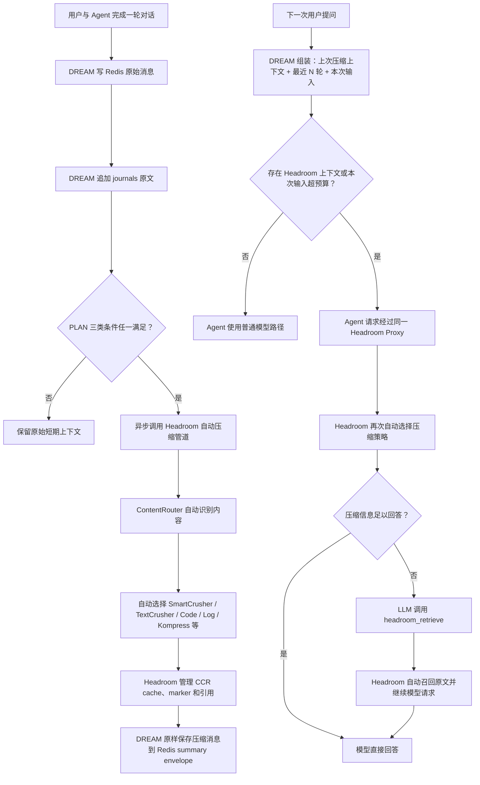

# short-term-memory README Redesign Implementation Plan

> **For agentic workers:** REQUIRED SUB-SKILL: Use superpowers:subagent-driven-development (recommended) or superpowers:executing-plans to implement this plan task-by-task. Steps use checkbox (`- [ ]`) syntax for tracking.

**Goal:** Rewrite the repository README so a company Agent developer can understand the PLAN-aligned short-term memory architecture and complete Redis, Headroom, configuration, SDK integration, and verification from one document.

**Architecture:** Keep the reference README's progression from architecture and dependencies into project structure, integration, configuration, and development. Put a practical Quick Start immediately after the architecture. Recreate the user-provided SVG as an equivalent Mermaid diagram without copying the SVG file or adding medium/long-term memory modules.

**Tech Stack:** Markdown, Mermaid, Python 3.11–3.13, redis-py 6.4.0, Redis Server 7.2.15, Headroom 0.33.0 HTTP Proxy, pytest, Ruff.

## Global Constraints

- Modify only `README.md`; do not change runtime source, dependencies, compose files, or the supplied SVG.
- The architecture diagram must preserve the exact nodes and branches from `/Users/fenghao/PycharmProjects/dream/mermaid-diagram.svg`.
- The public Python boundary is `build_runtime()`, `runtime.prepare_turn()`, and `runtime.complete_turn()`.
- Redis keys remain `dream:session:{user_id}:{session_id}:messages` and `dream:session:{user_id}:{session_id}:summary`.
- Redis default TTL remains 43200 seconds; Headroom trigger ratio remains constrained to 0.60–0.70.
- Redis and Headroom are external services; no Redis or Headroom source/model is vendored.
- Do not document a chat HTTP API, final-answer model, Wiki, Persona, Decision Card, Curator, Memory Retrieval Skill, or Daily Memory Job as part of this package.
- State that official CCR is integrated at the Proxy/scope boundary but that transparent continuation is not yet fully accepted against the tested Headroom 0.33.0 fake OpenAI upstream.

---

### Task 1: Rewrite the README around the short-term memory integration journey

**Files:**
- Modify: `README.md`

**Interfaces:**
- Consumes: `short_term_memory.build_runtime`, `short_term_memory.config.load_settings`, `short_term_memory.storage.redis_runtime.RedisRuntime`, `ShortTermMemoryRuntime.prepare_turn`, `ShortTermMemoryRuntime.complete_turn`.
- Produces: a standalone onboarding and architecture document for company Agent developers.

- [ ] **Step 1: Replace the current introduction and architecture**

Start the README with a concise description of the component and a boundary table. Add an architecture section using this exact graph:



Explain directly below the diagram that the left chain is post-turn background precomputation and the right chain is next-turn Agent context/Proxy handling. Do not connect `J` to `K`, because the supplied SVG renders them as two conceptual flows.

- [ ] **Step 2: Add a complete Quick Start**

Write numbered commands for:

```bash
git clone --branch short-term-memory --single-branch \
  https://github.com/ZCDu/AGFS-MEM.git short-term-memory
cd short-term-memory
python3.13 -m venv .venv
.venv/bin/python -m pip install -e ".[dev]"
docker compose -f compose.redis.yml up -d
docker compose -f compose.redis.yml exec redis redis-cli ping
uv tool install --python 3.13 "headroom-ai[all]==0.33.0"
HEADROOM_CCR_TTL_SECONDS=43200 headroom proxy --host 127.0.0.1 --port 8787 --mode token
curl http://127.0.0.1:8787/health
cp .env.example .env
```

List the production minimum environment:

```dotenv
SHORT_TERM_MEMORY_ENV=production
SHORT_TERM_MEMORY_HOME=~/.dream
SHORT_TERM_MEMORY_SCOPE_SECRET=replace-with-a-production-secret
REDIS_URL=redis://127.0.0.1:6379/0
HEADROOM_SERVICE_URL=http://127.0.0.1:8787
```

State that Headroom runs in a separate `uv tool` environment and is not installed into the project package.

- [ ] **Step 3: Add the Agent integration example**

Use imports that exist in the current source:

```python
from concurrent.futures import ThreadPoolExecutor
from pathlib import Path

from short_term_memory import build_runtime
from short_term_memory.config import load_settings
from short_term_memory.storage.redis_runtime import RedisRuntime

settings = load_settings(Path(".env"))
redis_runtime = RedisRuntime.connect(settings.redis_session.url)

runtime = build_runtime(
    home=Path(settings.home).expanduser(),
    settings=settings,
    redis_client=redis_runtime.client,
    token_estimator=company_token_estimator,
    summary_model=company_session_summary_model,
    executor=ThreadPoolExecutor(max_workers=2),
    retry_queue=company_background_retry_queue,
)

prepared = runtime.prepare_turn(
    user_id="user-001",
    session_id="session-001",
    content="继续刚才的 Redis 设计",
    session_seconds=1800,
)

assistant_text = company_agent_generate(
    messages=list(prepared.history),
    base_url=prepared.headroom_proxy_url,
    default_headers=prepared.headroom_headers,
)

result = runtime.complete_turn(
    prepared,
    assistant_content=assistant_text,
)

redis_runtime.close()
```

Explain that the four `company_*` objects/functions are injected by the company integration and that this package does not generate the final answer.

- [ ] **Step 4: Add reference sections following the supplied README style**

Add sections in this order:

```text
依赖与部署关系
项目结构
核心接口
Redis、journals 与 summary
Headroom 压缩与 CCR
配置
容错与可观测性
测试
当前限制
```

The configuration section must be a table containing every variable from `.env.example`, its default, and production requirement. The telemetry section must name success, failure, fallback, noop, attached-context counters and compression ratio without claiming a specific monitoring backend.

- [ ] **Step 5: Run README consistency scans**

Run:

```bash
rg -n "from dream|import dream|src/dream|tests/headroom|tests/integrations" README.md
rg -n "build_runtime|prepare_turn|complete_turn|RedisRuntime|HEADROOM_SERVICE_URL|SHORT_TERM_MEMORY_SCOPE_SECRET" README.md
git diff --check
```

Expected: the first command returns no matches; the second finds all required API/config names; `git diff --check` returns no errors.

- [ ] **Step 6: Commit the README rewrite**

```bash
git add README.md
git commit -m "docs: rewrite short term memory onboarding"
```

---

### Task 2: Verify documentation against the current package

**Files:**
- Verify: `README.md`
- Reference: `src/short_term_memory/api/runtime.py`
- Reference: `src/short_term_memory/config.py`
- Reference: `src/short_term_memory/storage/redis_runtime.py`
- Reference: `.env.example`
- Test: `tests/`

**Interfaces:**
- Consumes: the rewritten README and current public package.
- Produces: evidence that the documented API, variables, file paths, and package behavior match the repository.

- [ ] **Step 1: Compare documented imports and environment variables**

Run:

```bash
rg -n "^class RedisRuntime|^def build_runtime|    def prepare_turn|    def complete_turn" \
  src/short_term_memory/storage/redis_runtime.py \
  src/short_term_memory/api/runtime.py
rg -o "[A-Z][A-Z0-9_]+=" .env.example | sort
rg -o "[A-Z][A-Z0-9_]+=" README.md | sort -u
```

Expected: all README runtime names exist in source, and all `.env.example` variables appear in the README configuration section.

- [ ] **Step 2: Run deterministic regression checks**

Run:

```bash
PYTHONPATH=src /Users/fenghao/PycharmProjects/dream/DREAM/.venv/bin/python -m pytest -q
/Users/fenghao/PycharmProjects/dream/DREAM/.venv/bin/python -m ruff check src tests
git diff --check
```

Expected: 108 deterministic tests pass, 9 external-service tests remain skipped, Ruff reports `All checks passed!`, and the diff check is clean.

- [ ] **Step 3: Confirm the working tree and hand off external tests**

Run:

```bash
git status --short
```

Expected: no output after the README commit. Report separately that Redis, Headroom live routing, and transparent CCR continuation require the documented opt-in commands and running external services; do not convert a skipped or vendor-blocked test into a pass claim.
