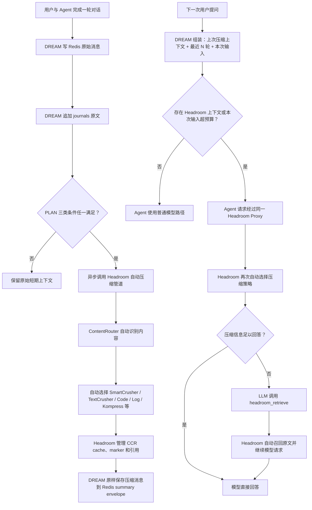

# short-term-memory README 重写规格

## 目标

参考用户提供的 `README (1).md` 章节组织方式，结合 `PLAN.md` 第 5 节短期记忆要求、
当前 `short_term_memory` SDK 的真实接口，以及用户提供的 `mermaid-diagram.svg`，重写项目
根目录 README。README 面向首次接入该组件的公司 Agent 开发者，必须能够指导其完成安装、
Redis/Headroom 部署、配置、回答前后 SDK 调用和基本验证。

## 章节结构

1. 项目简介与能力边界。
2. 架构。
3. 快速开始。
4. 依赖与部署关系。
5. 项目结构。
6. Agent SDK 调用边界。
7. Redis、journals 与 session summary。
8. Headroom 触发、压缩、Proxy 与 CCR。
9. 配置表。
10. 容错与可观测性。
11. 测试与已知限制。

## 架构图约束

README 使用 Mermaid 重画架构，不复制或嵌入 SVG。图中节点、分支和语义必须与
`/Users/fenghao/PycharmProjects/dream/mermaid-diagram.svg` 保持一致：

不得把两个独立链路擅自合并，也不得新增中长期记忆、Wiki 或检索模块节点。

## 快速开始

快速开始必须提供可按顺序执行的步骤：

1. 创建 Python 3.11–3.13 虚拟环境并安装 `.[dev]` 或 wheel。
2. 用仓库现有 `compose.redis.yml` 启动 `redis:7.2.15-bookworm`，并验证 `PONG`。
3. 用隔离的 `uv tool` 安装官方 `headroom-ai[all]==0.33.0`，启动端口 8787 的 Proxy，
   检查 `/health`。
4. 从 `.env.example` 创建配置，说明 production 必须配置 `HEADROOM_SERVICE_URL` 和
   `SHORT_TERM_MEMORY_SCOPE_SECRET`。
5. 展示 `load_settings`、`RedisRuntime.connect`、`build_runtime` 的完整装配示例。
6. 展示公司 Agent 在生成回答前调用 `runtime.prepare_turn()`、使用
   `PreparedTurn.history/headroom_proxy_url/headroom_headers` 发起模型请求，并在回答后调用
   `runtime.complete_turn()`。

示例中的 token estimator、SummaryModel、executor、RetryQueue 必须明确为公司侧注入依赖；
README 不得暗示组件内置最终回答模型或聊天 HTTP 接口。

## 内容边界

README 只描述：

- Redis Session Context；
- journals JSONL；
- Redis 过期后的同 session 恢复；
- 最近 N 轮与 session summary；
- PLAN 三类 Headroom 触发条件；
- Headroom HTTP `/v1/compress`、实时 Proxy 与官方 CCR 边界；
- 五类短期摘要；
- Python SDK 和可观测性。

不描述旧 Persona、Decision Card、Curator、Memory Retrieval Skill、Wiki、Daily Memory Job
或中长期索引实现。

## 正确性约束

- Redis key 必须保持：
  `dream:session:{user_id}:{session_id}:messages` 和
  `dream:session:{user_id}:{session_id}:summary`。
- 默认 TTL 为 43200 秒。
- Headroom 触发比例必须位于 0.60–0.70。
- 正常在线读记忆默认只读 Redis；journals 仅在 Redis 过期恢复时进入在线链路。
- summary 只写 Redis，不写 Wiki。
- development 允许 fallback；production 失败不摘要、不写 summary、不裁剪 Redis。
- Headroom 自动选择压缩器，组件不强制 Kompress。
- README 必须区分“已接入官方 CCR 边界”和“透明召回已经完成真实供应商验收”。当前
  Headroom 0.33.0 假 OpenAI 上游测试产生了 CCR 引用，但没有自动完成第二次续跑，因此
  不得宣称透明 CCR 已完全验收。

## 验证

- 检查 README 中所有命令、环境变量、路径和 Python import 与当前源码一致。
- 检查 README 不含 `dream.*` Python 导入或已经删除的文件路径。
- 运行确定性测试与 Ruff，确保文档改动没有伴随错误的源码调整。
